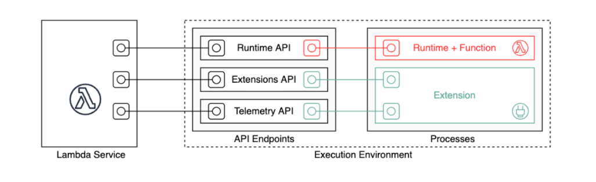

# TECH INFO

## 목차
1. [Mobile Applications](#Mobile-Applications)
2. [Cloud Providers](#Cloud-Providers)
3. [SERVERLESS](#SERVERLESS)

## Mobile Applications
### React Native
- Component
  - 유저 인터페이스를 구성하는 요소
  - 컴포넌트 생성
    - ```
      const App = () => { 
        return (
          <SafeAreaView>
          </SafeAreaView>
      )} 
      ```
    - Props(Properties)를 설정하여 컴포넌트에 전달할 수 있다.
    - JSX 문법
      - 태그를 열면 반드시 닫아주기 `<Text></Text>`
      - 스스로 닫는 태그 사용하기   `<Text />`
      - 반환할 때 반드시 하나의 태그로 감싸기
      - JSX 안에서 자바스크립트 표현식을 보여줄 땐 중괄호 사용
    
- Hooks
  - useState
    - 상태 값을 관리하는 함수
    - `const [visible, setVisible] = useState[true]`
- Context API
  - 컴포넌트 사이에 공유되는 데이터를 위해 매번 공통 부모 컴포넌트를 수정하고 모든 컴포넌트에 
    Props를 전달하여 데이터를 사용하는 과정은 비효율적이다. 이처럼 비효율적인 문제를 해결하기 위해 
    리액트에서는 Flux라는 개념을 도입하였고, 그에 걸맞은 Context API를 제공하기 시작했다.
  - Context는 부모 컴포넌트로부터 자식 컴포넌트로 전달되는 데이터의 흐름과는 상관없이, 전역적으로
    사용되는 데이터를 다룬다.
  - Context를 사용하기 위해서는 Context Api를 사용하여 Context의 프로바이더(Provider)와
    컨슈머(Consumer)를 생성한다.
  - Context에 저장된 데이터를 사용하기 위해서는 공통 부모 컴포넌트에 Context의 프로바이더를 사용하여
    데이터를 제공하다. 그리고 데이터를 사용하려는 컴포넌트에서 Context의 컨슈머를 사용하여 실제
    데이터를 사용(소비)한다.
- AsyncStorage
  - 리액트에서 데이터를 다루는 Props와 State, Context는 휘발성이다. 이 데이터는 메모리에서만 존재하며, 
    물리적으로 데이터를 저장하지 않는다. 따라서 데이터들은 API를 통해 서버에 저장하여 사용하거나, 앱 내에 
    저장하여 사용하는 경우가 많다.
  - AsyncStorage는 앱 내에서 간단하게 데이터를 저장할 수 있는 저장소이다.
  - 웹에서 사용하는 windows.localStorage와 매우 유사하다.
  - AsyncStorage는 키 값 저장소로서 간단하게 앱 내에 데이터를 저장하기 위해 사용할 수 있다.

<hr />

## Cloud Providers
### AWS

<hr />

## SERVERLESS
### AWS LAMBDA
- Lambda기본
  - Lambda는 빠르게 스케일 업해야 하고 수요가 없을 때는 0으로 스케일 다운해야 하는 애플리케이션 시나리오에 이상적인 컴퓨팅 서비스이다.
  - 개념
    - 함수
      - 함수는 Lambda에서 코드를 실행하기 위해 호출할 수 있는 리소스이다.
    - 트리거
      - 트리거는 Lambda에서 함수를 호출하는 리소스 또는 구성이다.
    - 이벤트
      - 이벤트는 처리할 Lambda 함수에 대한 데이터가 포함된 JSON 형식 문서이다.
    - 실행환경
      
      - 함수의 런타임은 런타임 API를 사용하여 Lambda와 통신한다. 익스텐션은 익스텐션 API를 사용하여
        Lambda와 통신한다. 또한 확장은 텔레메트리 API를 사용하여 함수의 로그 메시지와 기타 텔레메트리
        데이터를 수신할 수 있다.
  - Lambda 배포 패키지
    - .zip 파일 아카이브
      - Lambda 콘솔 사용
        1. Lambda 콘솔에서 함수 페이지를 연다
        2. 함수를 선택
        3. 코드 소스 창에서 업로드 원본을 선택한 다음 .zip 파일을 선택
        4. [업로드]를 선택하여 로컬 .zip 파일을 선택
        5. 저장을 선택
      - AWS CLI 사용
      - Amazon S3 사용
- 함수 배포
  - zip 파일 아카이브
    - Lambda 콘솔이나 도구 키트를 사용하여 함수를 작성하면 Lambda가 코드의.zip 파일 아카이브를 자동으로 생성
    - Lambda API, 명령줄 도구 또는 AWS SDK를 사용하여 함수를 생성하는 경우 배포 패키지를 생성해야 함.
    - 함수가 컴파일된 언어를 사용하거나 함수에 종속 항목을 추가하는 경우에도 배포 패키지를 생성해야 함.
  - 컨테이너 이미지
    - Docker 명령줄 인터페이스(CLI)와 같은 도구를 사용하여 코드 및 종속 항목을 컨테이너 이미지로 패키지화할 
      수 있다. 그런 다음 Amazon Elastic Container Registry(Amazon ECR)에서 호스팅되는 컨테이너 
      레지스트리에 이미지를 업로드할 수 있다.
- 함수 호출
  - 함수 URL 생성 및 관리
    - 함수 URL은 Lambda 함수를 위한 전용 HTTP(S) 엔드포인트이다.
    - 함수 URL 엔드포인트는 다음 형식을 취한다.
      - ```https://<url-id>.lambda-url.<region>.on.aws```
    - 함수 URL 생성(콘솔)
      - 함수 URL을 사용하여 새 함수를 생성하려면(콘솔)
        1. Lambda 콘솔의 함수 페이지를 연다.
        2. 함수 생성(Create function)을 선택
        3. 기본 정보에서 다음과 같이 한다.
           1) 함수 이름(Function name)에 my-function과 같은 함수 이름을 입력
           2) 런타임(Runtime)에서 원하는 언어 런타임을 선택합니다(예: Node.js 18.x).
           3) 아키텍처(Architecture)에서 x86_64 또는 arm64를 선택
           4) 권한(Permissions)을 확장한 다음, 새 실행 역할을 생성할지 아니면 기존 역할을 사용할지 여부를 선택
        4. 고급 설정(Advanced settings)을 확장한 다음 함수 URL(Function URL)을 선택
        5. 인증 유형(Auth type)에서 AWS_IAM 또는 NONE을 선택
        6. 함수 생성(Create function)을 선택
    - 함수 URL 생성(AWS CLI)
      - AWS Command Line Interface(AWS CLI)를 사용하여 기존 Lambda 함수에 대한 함수 URL을 생성하려면 
        다음 명령을 실행
        ``` 
           aws lambda create-function-url-config \
             --function-name my-function \
             --qualifier prod \ // optional
             --auth-type AWS_IAM
             --cors-config {AllowOrigins="https://example.com"} // optional
        ```
        이렇게 하면 함수 my-function에 대한 prod 한정자에 함수 URL이 추가됨
