# TECH INFO

## 목차
0. [CS](#CS)
   1. [Software Engineering](#Software-Engineering)
1. [FRONT](#FRONT)
   1. [HTML](#HTML)
   2. [JavaScript](#JavaScript)
   3. [Package Manager](#Package-Manager)
   4. [Framework](#Framework)
   5. [Type Checkers](#Type-Checkers)
   6. [Server Side Rendering](#Server-Side-Rendering)
   7. [Mobile Applications](#Mobile-Applications)
2. [BACK](#BACK)
   1. [Language](#Language)
   2. [Framework BackEnd](#Framework-BackEnd)
   3. [NoSQL](#NoSQL)
3. [DEVOPS](#DEVOPS)
   1. [Cloud Providers](#Cloud-Providers)
   2. [SERVERLESS](#SERVERLESS)
4. [Architecture](#Architecture)
   1. [Multi Module](#Multi-Module)

## CS
### Software Engineering
#### UML
##### 유스케이스 다이어그램
- 사용자(Actor)의 관점에서 시스템의 기능, 상호작용과 그들간의 관계를 표현한다.
- 사용하는 이유
  - 제품과 상호작용하여 얻을 수 있는 목표를 자세히 설명할 수 있다.
  - 시스템의 요구사항을 요약하고 정의할 수 있다.
  - 시스템 이벤트의 기본적인 흐름을 모델링할 수 있다.
- 구성요소
  1. 시스템(System)
     - 개발하고자 하는 것 그 자체이며, 웹사이트가 될 수도 있고, 소프트웨어
        컴포넌트, 애플리케이션 등 다양한 시스템이 될 수 있다.
     - 사각형의 형태로 표시하고, 상단에 시스템의 이름을 정의한다.
  2. 액터(Actor)
     - 시스템 외부에서 시스템과 상호작용하여 특정한 목적을 취하는 객체를 뜻한다.
     - 액터는 사람이 될 수도 있고, 회사, 다른 시스템, 또는 외부 장비가 될 수도 있다.
     - 액터는 두가지 종류가 있다.
  3. 유스케이스(Use Cases)
     - 시스템 내에서 일련의 작업을 수행하기 위한 행위들을 나타내며, 타원형으로 표기한다.
  4. 관계(Relationships)
     - 선 또는 화살표로 나타내며, 이어진 2개의 액터 또는 유스케이스들이 서로 상호
       작용함을 나타낸다
     - 관계는 총 4가지 종류가 있다.
       1. 연관 관계(Association)
          - 유스케이스와 액터 사이에 상호작용이 있다는 뜻으로, 실선으로 표시한다.
            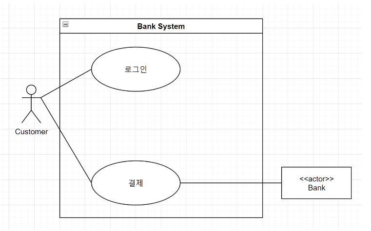
       2. 포함 관계(Include)
          - 포함 관계는 두 유스케이스 간의 의존성을 나타낸다.
            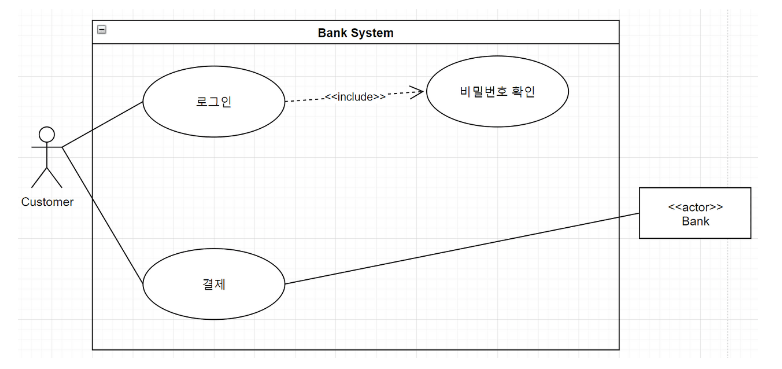
       3. 확장 관계(Extend)
          - 확장 관계는 두개의 유스케이스 간의 확장성을 나타낸다.
          - 하나의 유스케이스가 실행될 때 포함 관계에 있는 유스케이스가 특정 상황에서만 실행된다는 뜻이다.
            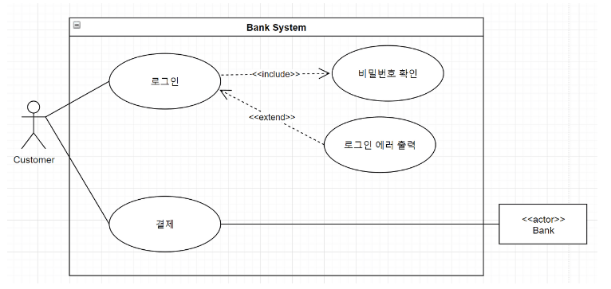
       4. 일반화 관계(Generalization)
          - 일반화 관계는 부모 유스케이스와 자식 유스케이스들 간의 상속관계를 나타낸다.
            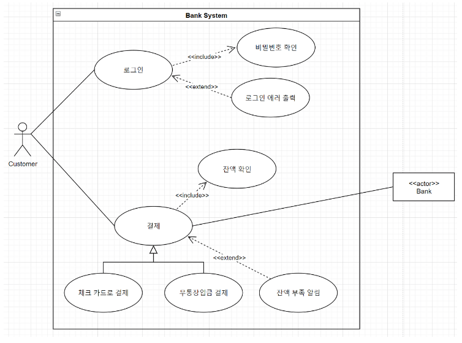
          - 확장 관계와의 차이점
            - 일반화 관계에 있는 자식 유스케이스들은 부모의 속성들을 물려받기 때문에, 부모 유스케이스가
              해당된 모든 포함, 확장 관계를 만족해야 한다.
            - 반면에 확장 관계에 있는 유스케이스는 속성을 물려받은 것이 아니므로, 기존 유스케이스와의
              관계를 만족하지 않아도 된다.
- 작성 순서
  1. 시스템 정의: 시스템 영역과 이름을 정의한다.
  2. 액터 정의: 사용자를 정의한다. 시스템과 상호작용하는 외부 시스템을 정의한다.
  3. 유스케이스 정의: Actor가 요구하는 서비스를 식별한다. Actor들이 시스템과 상호작용하는 행위를 식별한다.
  4. 관계 정의: Actor와 Actor 사이의 관계를 정의한다. Actor와 유스케이스 사이의 관계를 정의한다. 유스케이스 간의 관계를 정의한다.
  5. 유스케이스 구조화: 두 개 이상의 유스케이스의 공통된 서비스를 추출하여 일반화시킨다.


## FRONT
### HTML
- SEO Basics
  - search engine optimization : 검색 엔진 최적화
  - 웹 페이지 검색 엔진이 자료를 수집하고 순위를 매기는 방식에 맞게 웹 페이지를 구성해서 검색 결과 상위에 노출되도록 최적화한다.
  - 유료 비용이 들지 않으며, 주요한 마케팅 방법 중 하나이다.
  - 검색 엔진 최적화를 위한 작업
    - 메타 태그
      - `<title>` : 검색 결과로 노출되는 제목  
      - `<description>` : 해당 웹 페이지를 요약한 간략한 문장  
      - `<robots>` : 로봇의 접근 여부 설정  
      - `<canotical>` : 해당 페이지의 대표 URL
    - 오픈 그래프 태그
      - SNS에서 공유될 시 어떻게 노출될지 정의해주는 것
      - 아래와 같이 작성한다.
        ```
          <meta content="website" property="og:type">
          /* property options 
             og:title
             og:description
             og:image
             og:type
             og:url
          */
        ```

### JavaScript
- 일반 함수과 화살표 함수에서 this의 차이
  - 일반 함수는 자신이 종속된 객체를 this로 가리키며, 화살표 함수는 종속된 인스턴스를 가리킨다.
    ```
    function BlackDog() {
      this.name = '흰둥이';
      return {
        name: '검둥이',
        bark: function() {
          console.log(this.name + ': 멍멍!');
        }
      }
    }
    
    const blackDog = new BlackDog();
    blackDog.bark(); // 검둥이: 멍멍!
    
    function WhiteDog() {
      this.name = '흰둥이';
      return {
        name: '검둥이',
        bark: () => {
          console.log(this.name + ': 멍멍!');
        }
      }
    }
    
    const whiteDog = new WhiteDog();
    whiteDog.bark(); // 흰둥이: 멍멍!
    ```
- 화살표 함수는 따로 {}를 열어 주지 않으면 연산한 값을 그대로 반환한다는 의미이다.
  ```
  const triple = (value) => value * 3;
  ```
- 자바스크립트에서 함수는 일급 객체다. 즉, 객체를 다루듯이 함수를 변수에 할당하거나, 함수를 다른 함수로
  전달하거나, 함수에서 함수를 반환하거나, 객체와 프로토타입에 할당하거나, 함수에 프로퍼티를 기록하거나,
  함수에 기록된 프로퍼티를 읽는 등의 작업을 할 수 있다.
- 비동기 처리
  - 자바스크립트는 런타임에서 싱글 스레드로 동작하기 때문에 비동기 처리를 위해서는 콜백(callback), 프로미스(promise), 어싱크 어웨이트(async await) 방식을 사용한다.
  - 콜백
    - 함수의 파라미터로 함수를 전달
    - 가독성이 좋지 못하여 유지보수 및 디버깅이 힘들다.
  - 프로미스
    - 비동기 작업이 완료되면 결과를 반환하는 객체
    - then(), catch() 메서드를 사용하여 성공과 실패에 대한 처리가 가능하다.
  - 어싱크 어웨이트
    - 프로미스를 사용하는 비동기 작업을 동기적으로 처리하는 것처럼 코드를 작성할 수 있다.
    - async가 붙어 있는 함수를 실행할 때 await 키워드를 사용하여 비동기 작업이 완료될 때까지 기다릴 수 있다.
    - ```
      async function myName() {
        return "Andy";
      }
      
      async function showName() {
        const name = await myName(); // await는 promise 객체인 myName() 함수의 실행이 끝나길 기다린다.
        console.log(name);
      }
      
      console.log(showName());
      ```
- 전개 연산자(...문법)를 사용하여 객체나 배열 내부의 값을 복사할 때는 얕은 복사를 하게 된다. 즉, 내부의
  값이 완전히 새로 복사되는 것이 아니라 가장 바깥쪽에 있는 값만 복사된다. 따라서 내부의 값이 객체 혹은
  배열이라면 내부의 값 또한 따로 복사해 주어야 한다.
  ```
  const todos = [{id: 1, checked: true}, {id:2, checked: true}];
  const nextTodos = [...todos];
  
  nextTodos[0].checked = false;
  console.log(todos[0] === nextTodos[0]); // 아직까지는 똑같은 객체를 가리키고 있기 때문에 true
  
  nextTodos[0] = {
    ...nextTodos[0],
    checked: false
  };
  console.log(todos[0] === nextTodos[0]); // 새로운 객체를 할당해 주었기에 false
  ```
- immer를 사용하면 불변성을 유지하는 작업을 매우 간단하게 처리할 수 있다.
  ```
  import produce from 'immer';
  const nextState = produce(originalState, draft => {
    // 바꾸고 싶은 값 바꾸기
    draft.somewhere.deep.inside = 5;
  })
  ```
<hr />

### Package-Manager
- 패키지 매니저는 프로젝트에 필요한 의존성 패키지를 관리하는 프로그램을 의미한다.
  - 의존성 패키지는 해당 프로젝트를 실행하는 데 꼭 필요한 라이브러리와 모듈들이다.
#### npm
- npm은 자바스크립트용 패키지 매니저이다. 유저가 만든 패키지를 등록하는 저장소를 의미하기도 하고
  CLI를 의미 하기도 한다. Node.js를 설치할 때 함께 설치된다.
- 설치 명령어  
  ```
  npm install [<@scope>/]<name>@<tag/version/version range>
  npm i
  npm add
  ```
- package-lock
  - package.json에 버전을 설정할 때 특정 버전이 아닌 버전 범위를 설정하면 패키지를 설치하는 시점에 따라 다른 버전이 설치된다.
    하위 호환에 대한 검증을 진행하지 않기 때문에 문제가 발생할 수 있어 설치 시 올바르게 동작하는 버전을 고정하는 이데 대한 패키지의
    의존성 트리를 package-lock.json에 저장해둔다.

#### yarn


<hr />

### Framework
#### React
- 네이밍 규칙
  - 컴포넌트가 단일 파일로 구성되는 경우 파일 이름은 대문자로 시작해야 한다.
    `MyComponent.js`와 같이 작성하며, 이는 해당 파일이 React 컴포넌트를 정의하고 있다는 것을 명시적으로 나타내기 위함이다.
  - 일반적인 JavaScript 함수 또는 유틸리티 함수를 정의하는 파일은 소문자로 시작한다. `helperFunctions.js`와 같이 소문자로 시작한다.
    ```
    const add = (a, b) => {
      return a + b;
    };
    
    export { add };
    ```
- JSX 코드는 브라우저에서는 직접 해석할 수 없으므로, 웹팩에 의해 자바스크립트 코드로 변환된다.
  이때, JSX로 구현된 컴포넌트는 자바스크립트의 객체로 표현된다. 변환된 자바스크립트 코드를
  브라우저가 읽어서 실행하고 화면을 그리기 시작한다.
- 리액트에서 DOM 요소에 스타일을 적용할 떄는 문자열 형태로 넣는 것이 아니라 객체 형태로
  넣어 주어야 한다. 스타일 이름 중에서 background-color처럼 - 문자가 포함되는 이름이 있으면,
  하이픈(-) 문자를 없애고 카멜 표기법으로 작성해야 한다.
- component
  - 라이프사이클 메서드 흐름
    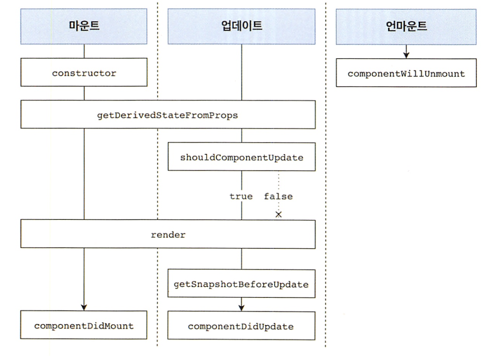
- Hooks
  - 상태 훅
    - useState
    - useEffect
    - useReducer
      - userReducer()의 반환값 배열의 첫 번째는 현재 상태, 두 번째는 dispatch 함수이다.
        dispatch 함수에 action을 전달함으로써 상태를 업데이트할 수 있다.
      - reducer가 현재 상태와 action을 기반으로 다음 상태를 결정한다.
        ```
        impport {useReducer} from 'react';
        
        function reducer(state, action) {
          // action.type에 따라 다른 작업 수행
          switch (action.type) {
            case 'INCREMENT':
              return { value: state.value + 1 };
            case 'DECREMENT':
              return { value: state.value - 1 };
            default:
              // 아무것도 해당되지 않을 떄 기존 상태 반환
              return state;
          }
        }
        
        const Counter = () => {
          const [state, dispatch] = useReducer(reducer, { value: 0 });
        
          return (
            <div>
              <p>
                현재 카운터 값은 <b>{state.value}</b>입니다.
              </p>
              <button onClick={() => dispatch({ type: 'INCREMENT' })}>+1</button>
              <button onClick={() => dispatch({ type: 'DECREMENT' })}>-1</button>
            </div>
          );
        };
        ```
      - useReducer를 사용했을 때의 가장 큰 장점은 컴포넌트 업데이트 로직을 컴포넌트 바깥으로
        빼낼 수 있다는 점이다.
  - 메모이제이션 훅
    - useMemo
    - useCallback
      - useMemo는 특정 결과값을 재사용 할 때 사용하는 반면, useCallback은 특정 함수를 새로 만들지 않고
        재사용하고 싶을 때 사용한다.
  - 라우팅 관련 훅
    - useParams
    - useSearchParams
  - 기타
    - useRef
      - 함수 컴포넌트에서 ref를 쉽게 사용할 수 있도록 한다. useRef를 사용하여 ref를
        사용하여 ref를 설정하면 useRef를 통해 만든 객체 안의 current 값이 실제 엘리먼트를 가리킨다.
      - 컴포넌트 로컬 변수를 사용해야 할 때도 useRef를 활용할 수 있다. 여기서 로컬 변수란
        렌더링과 상관없이 바뀔 수 있는 값을 의미한다.
- 컴포넌트 스타일링
  - 일반 CSS
  - Sass
    - 자주 사용되는 CSS 전처리기 중 하나로 확장된 CSS 문법을 사용하여 CSS 코드를 더욱 쉽게 작성할 수 있도록 해준다.
  - CSS Module
    - 스타일을 작성할 때 CSS 클래스가 다른 CSS 클래스의 이름과 절대 충돌하지 않도록 파일마다 고유한 이름을
      자동으로 생성해 주는 옵션이다.
  - styled-components
    - 스타일을 자바스크립트 파일에 내장시키는 방식으로 스타일을 작성함과 동시에 해당 스타일이 적용된 컴포넌트를
      만들 수 있게 해준다.
    - Tagged 템플릿 리터럴
      - 스타일을 작성할 때 `을 사용하여 만든 문자열에 스타일 정보를 넣을 수 있는데, 이 문법을 Tagged 템플릿 리터럴
        이라고 부른다. CSS Module에 사용하는 일반 템플릿 리터럴과 다른 점은 템플릿 안에 자바스크립트 객체나 함수를
        전달 할 때 온전히 추출할 수 있다는 것이다.
- 리액트 라우터
  - Outlet component
    - 이 컴포넌트는 Route의 children으로 들어가는 JSX 엘리먼트를 보여준다. 
- context
  - Provider를 사용할 때 value를 명시하지 않으면 오류가 발생한다.
- 리덕스
  - 리덕스의 3가지 규칙
    1. 단일 스토어
       - 하나의 애플리케이션 안에는 하나의 스토어가 들어 있다.
    2. 읽기 전용 상태
       - 리덕스 상태는 읽기 전용이다. 상태를 업데이트 할 때 기존의 객체는
         건드리지 않고 새로운 객체를 생성해 주어야 한다.</br>
         리덕스에서 불변성을 유지해야 하는 이유는 내부적으로 데이터가 변경되는
         것을 감지하기 위해 얕은 비교 검사를 하기 때문이다.
         객체의 변화를 감지할 때 겉만 비교하여 좋은 성능을 유지할 수 있다.
    3. 리듀서는 순수한 함수
       - 변화를 일으키는 리듀서 함수는 순수한 함수여야 한다. 순수한 함수는
         다음 조건을 만족한다.
         1. 리듀서 함수는 이전 상태와 액션 객체를 파라미터로 받는다.
         2. 파라미터 외의 값에는 의존하면 안 된다.
         3. 이전 상태는 절대로 건드리지 않고, 변화를 준 새로운 상태 객체를
            만들어서 반환한다.
         4. 똑같은 파라미터로 호출된 리듀서 함수는 언제나 똑같은 결과 값을
            반환해야 한다.
- zustand
  - 리덕스와의 비교
    - 상태 모델
      - 개념적으로 Zustand와 Redux는 매우 유사하며 둘 다 불변 상태 모델을 기반으로 한다.
        그러나 Redux를 사용하려면 앱을 context provider로 래핑해야한다. zustand는 그렇지 않다.
    - 렌더링 최적화
      - 앱 내 렌더링 최적화와 관련하여 Zustand와 Redux의 접근 방식에는 큰 차이가 없다. 두 라이브러리 모두
        선택기를 사용하여 렌더링 최적화를 수동으로 적용하는 것이 좋다.
<hr />

### Type Checkers
#### TypeScript
- 변수 선언하는 방식은 다음과 같다.
  ```
  선언 키워드 변수명: 타입
  let a: number;
  ```
  - 선언 키워드 let과 var의 차이는 호이스팅 여부이다.
    var은 변수를 사용한 후에 선언이 가능하지만 let은 불가능하다.
- arrow function의 경우 다음과 같이 타입을 지정한다.
  ```
  (인수명: 인수_타입): 반환값_타입 => 자바스크립트_식
  let sayHello = (name: string): string => `Hello ${name}`
  ```
- 타입스크립트에서 지원하는 타입
  - 원시 값, 객체, 함수
  - any : 어떤 타입의 변수에도 할당 가능
  - unknown : 어떤 타입도 할당 가능하지만 다른 변수에 할당 또는 사용할 때 타입을 강제함
  - never : 어떤 값도 할당 불가능
- 타입 구성하는 방법
  - 유니언 : `|`를 사용하여 여러 타입을 조합할 수 있다.
  ```
  function getLength(obj: string | string[]) {
    // obj는 sting 또는 string 배열 타입일 수 있음
  }
  
  type status = "Ready" | "Waiting" //변수가 가질 수 있는 값을 제한
  ```
  - 제네릭 : 어떤 타입이든 정의될 수 있지만 호출되는 시점에 타입이 결정된다.
- 데커레이터를 활용하여 횡단 관심사를 분리하여 관점 지향 프로그래밍을 적용한 코드를 적용할 수 있다.
- 에러처리
  - null 반환
    - 타입 안정성을 유지하면서 에러를 처리하는 가장 간단한 방법이다.
    - 로그를 일일이 확인해가며 디버깅을 해야 한다.
    - 모든 연산에서 null을 확인해야 하므로 연산을 중첩하거나 연결할 때 코드가 지저분해진다.
  - 예외 던지기
  - 예외 반환
    - 예외 반환을 한 것에 대해 처리해야 하며 그렇지 않으면 컴파일 타입에 TypeError가 발생한다.
  - Option 타입
  
<hr />

### Server Side Rendering
#### Next.js
- 라우팅
  - 버전13에서 Next.js는 공유 레이아웃, 중첩 라우팅, 로딩 상태, 오류 처리 등을 지원하는 React Server Components를 기반으로 
    구축된 새로운 App Router를 도입하였다.
  - 파일규칙
    - layout
      -  세그먼트 및 해당 하위 항목에 대한 공유 UI
    - page
      - 경로의 고유한 UI 및 경로에 공개적으로 액세스 가능
  - getServerSideProps
    - next.js의 내장 함수로서, URL에서 동적으로 변수값을 가져올 수 있게 한다.
  - 클라이언트에서의 내비게이션
    - Next.js에서는 애플리케이션 안의 다른 페이지로의 이동하기 위한 Link 컴포넌트가 있다.
- 렌더링 전략
  - SSR(Server-Side-Rendering)
    - 요청에 따라 서버에서 html 페이지를 동적으로 렌더링하고 웹 브라우저로 전송할 수 있다. 
      또한 서버에서 렌더링한 페이지에 스크립트 코드를 집어넣어서 나중에 웹 페이지를 동적으로 처리할 수도 있는데 이를 하이드레이션이라고 한다.
    - 중요한 데이터를 클라이언트에 노출할 필요가 없기 때문에 더 안전하다.
    - 봇, 웹 크롤러 같은 검색 엔진 웹 문서 수집기가 페이지를 렌더링할 필요가 없어, 웹 애플리케이션의 SEO 점수가 높아진다.
  - CSR(Client-Side-Rendering)
    - 클라이언트에서의 내비게이션은 브라우저 화면을 새로 고칠 필요 없이 다른 페이지로의 이등이 가능하다.
    - 웹 앱에서는 최소로 필요한 html 마크업만 렌더링한다.
    - 전체 렌더링 과정이 브라우저에서 일어나기 때문에 서버 부하가 감소한다. AWS Lamda와 Firebase와 같은 서버리스 환경에서 웹 앱을 제공할 수도 있다.
  - ComponentDidMount / useEffect hook 활용
    - DOM 조작이나 데이터 불러오기 같은 사이드 이펙느 기능을 구현한다면 컴포넌트가 마운트된 후 해당 기능을 실행하도록 만들 수 있다. 
      즉, Nest.js가 useEffect를 리액트 하이드레이션 이후 브라우저에서 실행하도록 만든다. 이렇게 하면 특정 작업을 반드시 클라이언트에서 실행하도록 강제할 수 있다.
  - typeof 활용
    - 서버에서 렌더링할 때 브라우저 전용 API로 인한 문제를 해결하기 위해 사용한다.
    - typeof window 값이 서버에서 실행하면 "undefined" 값을 가진다.
  - 동적 컴포넌트 로딩
    - ```
      import dynamic from 'next/dynamic'
      const a = dynamic(
        () => import('../components/sample'), // sample 컴포넌트를 클라이언트에서 동적 임포트로 불러온다.
      { ssr: false }  // 서버 사이드 렌더링하지 않음을 명시한다.
      );
      ```
  - 정적 사이트 생성(SSG)
    - 웹 애플리케이션을 빌드할 때 내용이 거의 변하지 않는 페이지는 정적 페이지 형태로 만들어서 제공하는 것이 좋기 때문에 일부 또는 전체 페이지를 빌드 시점에 렌더링한다.
    - 빌드 시점에 렌더링되어 정적 자원처럼 제공하기 때문에 다음 배포 전까지 내용이 변하지 않는다. 수정을 해야하는 경우 증분 정적 재생성(ISR)을 사용하여
      어느 정도 주기로 정적 페이지를 다시 렌더링하고 내용을 업데이트할지 정한다.
    - getStaticProps next.js 기본 내장 함수이다. 빌드 과정에서 이 함수를 사용하여 다음 번 빌드 시점까지는 더 이상 호출하지 않도록 하는데, 
      validate 옵션을 사용하면 어느 주기로 새로 빌드할지 정할 수 있다. 
<hr />

### Mobile Applications
#### React Native
- Component
  - 유저 인터페이스를 구성하는 요소
  - 컴포넌트 생성
    - ```
      const App = () => { 
        return (
          <SafeAreaView>
          </SafeAreaView>
      )} 
      ```
    - Props(Properties)를 설정하여 컴포넌트에 전달할 수 있다.
    - JSX 문법
      - 태그를 열면 반드시 닫아주기 `<Text></Text>`
      - 스스로 닫는 태그 사용하기   `<Text />`
      - 반환할 때 반드시 하나의 태그로 감싸기
      - JSX 안에서 자바스크립트 표현식을 보여줄 땐 중괄호 사용
- react-native component
  - SafeAreaView
    - iPhone X 이상 기종에서 디스플레이의 보이지 않는 영역 및 최하단 영역에 내용이 보여지는 것을
      방지해준다.
  - View
    - 가장 기본적인 컴포넌트로 레이아웃 및 스타일을 담당한다.
  - Text
    - 텍스트를 보여주는 역할을 한다.
  - TextInput
    - 키보드 입력을 받아낼 때 사용하는 컴포넌트
    - iOS는 화면의 하단 부분이 키보드에 가려지는 반면, 안드로이드는 화면이 줄어든다.
  - KeyboardAvoidingView
    - 텍스트를 입력할 때 키보드가 화면을 가리지 않게 하기 위해 사용하는 컴포넌트
  - StyleSheet
    - 스타일링 컴포넌트
    - 모든 스타일 속성은 camelCase로 작성해야 한다.
  - StatusBar
    - 화면 최상단 상태 영역
    - iOS는 색상을 바꾸려면 View로 색상을 채워야 한다.
    - 안드로이드는 색상을 StatusBar 컴포넌트의 backgroundColor 속성을 이용할 수 있다.
  - TouchableOpacity
    - 터치했을 때 투명도를 조정한다.
- Hooks
  - useState
    - 상태 값을 관리하는 함수
    - `const [visible, setVisible] = useState(true)`
- Context API
  - 컴포넌트 사이에 공유되는 데이터를 위해 매번 공통 부모 컴포넌트를 수정하고 모든 컴포넌트에 
    Props를 전달하여 데이터를 사용하는 과정은 비효율적이다. 이처럼 비효율적인 문제를 해결하기 위해 
    리액트에서는 Flux라는 개념을 도입하였고, 그에 걸맞은 Context API를 제공하기 시작했다.
  - Context는 부모 컴포넌트로부터 자식 컴포넌트로 전달되는 데이터의 흐름과는 상관없이, 전역적으로
    사용되는 데이터를 다룬다.
  - Context를 사용하기 위해서는 Context Api를 사용하여 Context의 프로바이더(Provider)와
    컨슈머(Consumer)를 생성한다.
  - Context에 저장된 데이터를 사용하기 위해서는 공통 부모 컴포넌트에 Context의 프로바이더를 사용하여
    데이터를 제공하다. 그리고 데이터를 사용하려는 컴포넌트에서 Context의 컨슈머를 사용하여 실제
    데이터를 사용(소비)한다.
- AsyncStorage
  - AsyncStorage는 리액트 네이티브에서 사용할 수 있는 key-value 형식의 저장소이다.
  - AsyncStorage는 앱 내에서 간단하게 데이터를 저장할 수 있는 저장소이다.
  - iOS에서는 네이티브 코드로 구현되어 있으며, 안드로이드에서는 네이티브 코드와 SQLite를 기반으로
    구현되어 있다.
  - 리액트에서 데이터를 다루는 Props와 State, Context는 휘발성이다. 이 데이터는 메모리에서만 존재하며, 
    물리적으로 데이터를 저장하지 않는다. 따라서 데이터들은 API를 통해 서버에 저장하여 사용하거나, 앱 내에 
    저장하여 사용하는 경우가 많다.
  - 웹에서 사용하는 windows.localStorage와 매우 유사하다.
  - AsyncStorage는 키 값 저장소로서 간단하게 앱 내에 데이터를 저장하기 위해 사용할 수 있다.
  - 설치하기</br>
    `$ yarn add @react-native-community/async-storage`
    - iOS에서는 다시 pod install 해줘야 한다.</br>
      ```
         $ cd ios
         $ pod install
      ```
- react-navigation
  - 여러 화면으로 구성된 애플리케이션을 만드려면 내비게이션 관련 서드 파티 라이브러리를 사용해야 한다.
  - 설치법</br>
    `$ yarn add @react-navigation/native`
    - 의존 라이브러리 설치</br>
      ` yarn add react-native-screens react-native-safe-area-context`
  - 다양한 내비게이터
    - Drawer Navigator
      - 좌측 혹은 우측에 사이드바를 만들고 싶을 때 사용하는 내비게이터이다.
      - 사이드바를 모바일 앱에서는 드로어라고 부른다.
      - 설치</br>
        `$ yarn install @react-navigation/drawer react-native-gesture-handler react-native-reanimated`
      - navigation.push, navigation.pop 같은 기능들은 드로어 내비게이터에서 호환되지 않는다.
    - Bottom Tab Navigator
      - 하단에 탭을 보여주는 내비게이터이다.
        - 설치</br>
        `$ yarn add @react-navigation/bottom-tabs react-native-vector-icons`
    - Material Top Tab Navigator
      - 탭을 상단에 위치시킬 수 있다.
      - 탭을 누르면 구글의 머티리얼 디자인 특유의 물결(ripple) 효과가 나타난다.
      - 화면을 스와이프하는 형태로 우측/좌측 탭으로 전환할 수도 있다.
      - 설치</br>
        `$ yarn add @react-navigation/material-top-tabs react-native-tab-view react-native-paper-view`
    - Material Bottom Tab Navigator
      - 설치</br>
        `$ yarn add @react-navigation/material-bottom-tabs react-native-paper`
  - 내비게이션 Hooks 
    - useNavigation
      - 이 Hook을 사용하면 Screen으로 사용되고 있지 않은 컴포넌트에서도 navigation 객체를 사용할 수 있다.
      - useNavigation을 사용하면 navigation을 상위 컴포넌트에서 Props로 넣어주지 않아도 사용할 수 있다.
    - useRoute
      - useRoute는 useNavigation과 비슷하게, Screen이 아닌 컴포넌트에서 route 객체를 사용할 수 있게 한다.
    - useFocusEffect
      - 화면에 포커스가 잡혔을 때 특정 작업을 할 수 있게 하는 Hook이다.

<hr />

## BACK
### Language
#### Node.js
- Node.js는 자바스크립트 코드 실행에 필요한 런타임으로 V8 엔진을 사용하고, 자바스크립트 런타임에
  필요한 이벤트 루프 및 운영체제 시스템 API를 사용하는 데는 libuv 라이브러리를 사용한다.
- Node.js의 특징
  - 싱글 스레드
    - 자바스크립트 엔진(V8)은 자바스크립트를 실행하는 힙과 콜 스택을 가지고 있다. 콜 스택이 하나이 하나이므로 한 번에 하나의 작업만 가능하다.
  - 이벤트 기반 아키텍처
    - 싱글 스레드의 문제를 해결하기 위해 이벤트 기반 아키텍처를 적용했다. 콜 스택에 쌓인 작업을 다른 곳에서 처리한 다음 처리가 완료되면 알림을 받는다.
    1. 동시 요청이 발생하는 경우 V8 콜 스택에 쌓이고 I/O 처리가 필요한 코드는 이벤트 루프로 보낸다. 
    2. 이벤트 루프에서는 루프를 실행하면서 운영체제 또는 스레드 워커에 I/O 처리를 맡긴다. 
    3. 받은 요청에 대한 결과를 이벤트 루프로 돌려주고 이벤트 루프에서는 결과값에 대한 코드를 콜스택에 다시 추가한다.
- Node.js의 장단점
  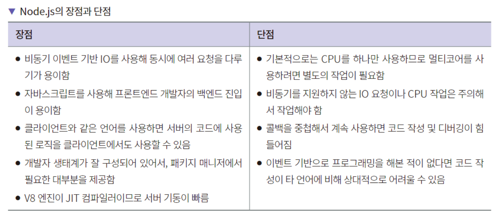
- node에서 mongoose를 사용할 시, 쿼리에 필터를 빈 객체인 {}로 넣으면 모든 값을 불러오게 되어서
  문제가 되는 경우가 있다. 이 경우 에러를 내도록 하는 설정이 strictQuery 설정이다. Mongoose6에서는
  기본값이 true이며 7에서는 false이다. 명시적으로 설정해주지 않으면 서버 기동 시 경고가 발생한다.
  ```
  const mongoose = require("mongoose");
  
  mongoose.set("strictQuery", false);
  ```

#### Java
- 자료구조
  - 배열과 리스트
    - 배열
      - 배열은 메모리의 연속 공간에 값이 채워져 있는 형태의 자료구조
      - 인덱스를 사용하여 값에 바로 접근 가능
      - 새로운 값을 삽입하거나 특정 인덱스에 있는 값을 삭제하기 어려움
      - 배열의 크기는 선언할 때 지정하며, 한 번 선언하면 크기를 늘리거나 줄일 수 없음
    - 리스트
      - 값과 포인터를 묶은 노드를 포인터로 연결한 자료구조
      - 인덱스가 없음
      - 포인터로 연결되어 있어 데이터를 삽입하거나 삭제하는 연산 속도가 쁘름
      - 크기가 가변적
  - 스택과 큐
    - 스택
      - 삽입과 삭제 연산이 후입선출(Last-in First-out)
      - push : top 위치에 새로운 데이터 삽입
      - pop : top 위치에 현재 있는 데이터를 삭제하고 확인
      - peek : top 위치에 현재 있는 데이터를 단순 확인
    - 큐
      - 삽입과 삭제 연산이 선입선출(First-in First-out)
      - add : rear 위치에 새로운 데이터 삽입
      - poll : front 위치에 있는 데이터를 삭제하고 확인
      - peek : front 위치에 있는 데이터를 단순 확인
      - 우선순위 큐 (Priority Queue) : 값이 들어간 순서와 상관 없이 우선순위가 높은 데이터가 먼저 나오는 자료구조

<hr />

### Framework BackEnd
#### EXPRESS
- HTTP에서 Body를 파싱하려면 bodyParser.json() 미들웨어를 추가해야 한다.
  ```
  const express = require("express");
  const bodyParser = require("body-parser");
  
  const app = express();
  app.use(bodyParser.json());
  ```
- EXPRESS에서의 3계층 아키텍처
  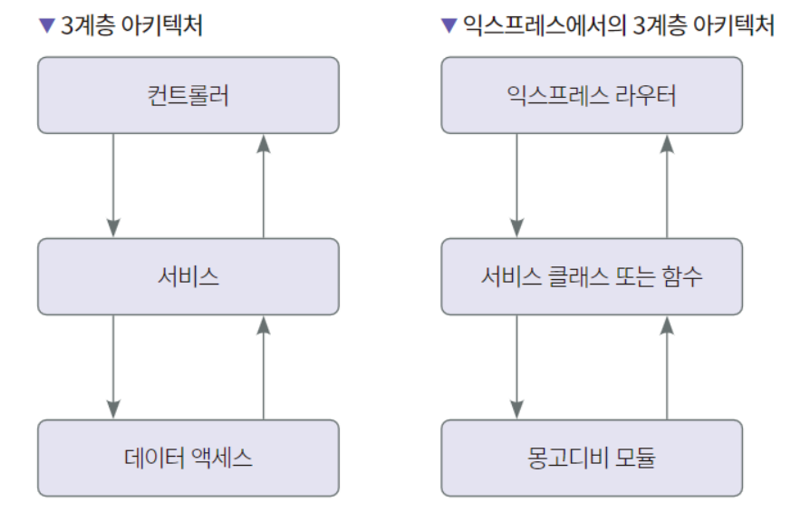
- 미들웨어
  - 익스프레스에서 미들웨어란 HTTP 요청과 응답 사이에 함수를 추가하여 새로운 기능을 추가하는 것을
    뜻한다.
<hr />

#### NestJS
- 익스프레스와 NestJS 비교
  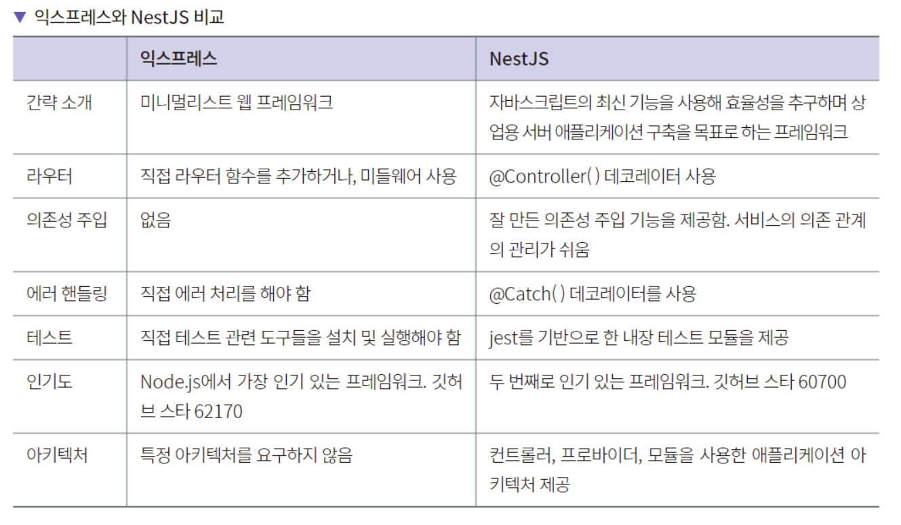
- NestJS의 핵심 기능으로 의존성 주입을 들 수 있다. 의존성 주입은 모듈 간의 결합도를 낮춰서 코드의
  재사용을 용이하게 한다. 즉, 모듈 내에서의 코드의 응집도는 높여서 모듈의 재사용을 꾀하고 모듈
  간에는 결합도를 낮춰서 다양한 아키텍처에서 활용할 수 있게 해준다. 이를 위한 장치들로 모듈, 가드,
  파이프, 미들웨어, 인터셉터 같은 모듈과 코드의 의존 관계를 구성하는 프로그래밍적 장치들이 있다.
- NestJS에서는 HTTP 요청을 보통 가드 -> 인터셉터 -> 파이프 -> 컨트롤러 -> 서비스 -> 리포지토리
  순서로 처리한다.

<hr />

### NoSQL
#### MongoDB
- 몽고디비에서 도큐먼트는 BSON이라는 데이터 포맷이다. BSON은 'Binary JSON'의 의미로 JSON을
  바이너리 형식으로 저장하는 형태이다.
- 몽고db 장단점
  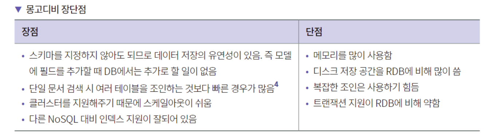
- 몽고db 구조 </br>
  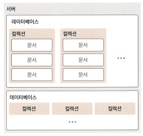
  - database
    - 데이터베이스는 컬렉션의 물리적 컨테이너 이다. 하나의 데이터베이스에는 보통 여러개의 컬렉션을 가지고 있다.
  - Collection
    - 컬렉션은 몽고DB의 Document의 그룹이며 RDBMS의 예를 들면 Table과 개념이 유사하다.
  - Document
    - Document는 하나의 키와 값의 집합으로 이루어져 있으며 동적 스키마이다.
    - 동적 스키마는 동일한 컬렉션 내의 도큐먼트가 동일한 필드 또는 구조를 가질 필요가 없음을 의미한다.
      또한, 동일한 필드안에 다른타입의 데이터를 보유할 수 있음을 의미한다.
- 몽고디비와 RDBMS의 구조 비교
  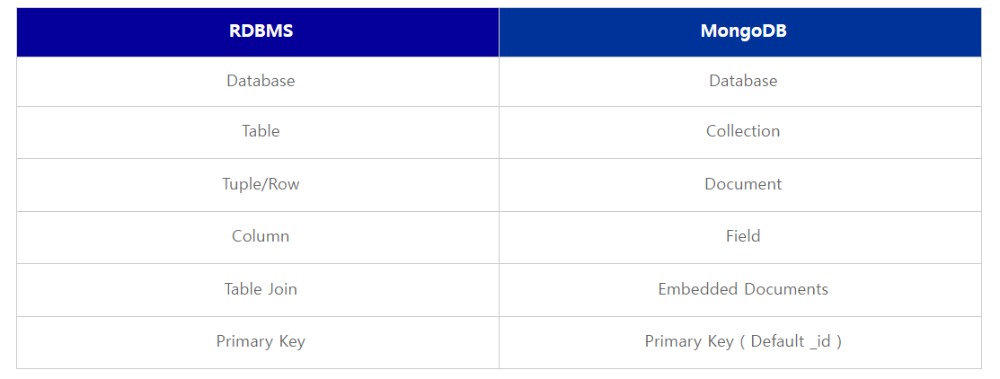

<hr />

## DEVOPS
### Cloud Providers
#### AWS
- AWS S3
  - 데이터를 버킷 내의 객체로 저장하는 객체 스토리지 서비스이다.
    객체는 해당 파일을 설명하는 모든 메타데이터이고, 버킷은 객체에 대한 컨테이너이다.
    각 객체에 키(또는 키 이름)이 있으며, 이는 버킷 내 객체에 대한 고유한 식별자이다.
  - 데이터 일관성 모델
    - 버킷에 있는 객체의 PUT 및 DELETE 요청에 대해 강력한 쓰기 후 읽기(read-after-write) 일관성을 제공한다.
    - 동시 작성자에 대한 객체 잠금을 지원하지 않는다. 두 PUT 요청을 동시에 같은 키에 대해 실행할 경우 타임스탬프가 최신인 요청이 우선 적용된다.
  - AWS S3 액세스
    - AWS Management Console
    - AWS Command Line Interface
    - AWS SDK
    - Amazon S3 REST API
- AWS ECR
  - 도커 이미지 파일을 pull, push 할 수 있는 컨테이너 이미지 저장소이다.
- AWS ECS
  - 컨테이너화된 애플리케이션을 쉽게 배포, 관리, 스케일링할 수 있도록 도와주는 완전 관리형 컨테이너 오케스트레이션 서비스이다.
  - 구성요소
    - 용량
      - 컨테이너가 실행되는 인프라
      - 옵션
        1. AWS EC2 인스턴스
        2. AWS Fargate
        3. 온프레미스 가상머신(VM) 또는 서버
    - 컨트롤러
      - 컨테이너에서 실행되는 애플리케이션을 배포하고 관리
    - 프로비저닝
      - 스케줄러와 함께 애플리케이션 및 컨테이너를 배포 및 관리하는 데 사용할 수 있는 도구
      - 옵션
        1. AWS Management Console
        2. AWS Command Line Interface
        3. AWS SDK
        4. Copilot
        5. AWS CDK

<hr />

### SERVERLESS
#### AWS LAMBDA
- Lambda기본
  - Lambda는 빠르게 스케일 업해야 하고 수요가 없을 때는 0으로 스케일 다운해야 하는 애플리케이션 시나리오에 이상적인 컴퓨팅 서비스이다.
  - 개념
    - 함수
      - 함수는 Lambda에서 코드를 실행하기 위해 호출할 수 있는 리소스이다.
    - 트리거
      - 트리거는 Lambda에서 함수를 호출하는 리소스 또는 구성이다.
    - 이벤트
      - 이벤트는 처리할 Lambda 함수에 대한 데이터가 포함된 JSON 형식 문서이다.
    - 실행환경
      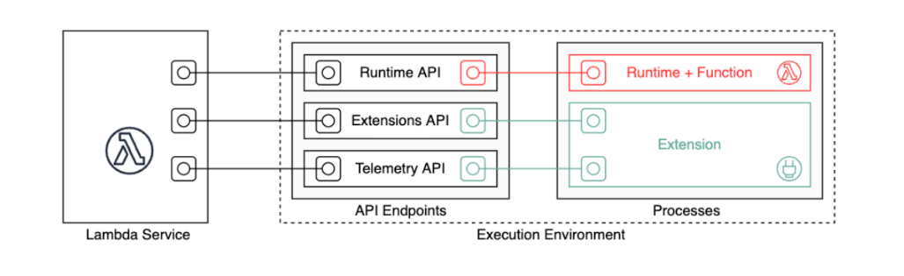
      - 함수의 런타임은 런타임 API를 사용하여 Lambda와 통신한다. 익스텐션은 익스텐션 API를 사용하여
        Lambda와 통신한다. 또한 확장은 텔레메트리 API를 사용하여 함수의 로그 메시지와 기타 텔레메트리
        데이터를 수신할 수 있다.
  - Lambda 배포 패키지
    - .zip 파일 아카이브
      - Lambda 콘솔 사용
        1. Lambda 콘솔에서 함수 페이지를 연다
        2. 함수를 선택
        3. 코드 소스 창에서 업로드 원본을 선택한 다음 .zip 파일을 선택
        4. [업로드]를 선택하여 로컬 .zip 파일을 선택
        5. 저장을 선택
      - AWS CLI 사용
      - Amazon S3 사용
- 함수 배포
  - zip 파일 아카이브
    - Lambda 콘솔이나 도구 키트를 사용하여 함수를 작성하면 Lambda가 코드의.zip 파일 아카이브를 자동으로 생성
    - Lambda API, 명령줄 도구 또는 AWS SDK를 사용하여 함수를 생성하는 경우 배포 패키지를 생성해야 함.
    - 함수가 컴파일된 언어를 사용하거나 함수에 종속 항목을 추가하는 경우에도 배포 패키지를 생성해야 함.
  - 컨테이너 이미지
    - Docker 명령줄 인터페이스(CLI)와 같은 도구를 사용하여 코드 및 종속 항목을 컨테이너 이미지로 패키지화할 
      수 있다. 그런 다음 Amazon Elastic Container Registry(Amazon ECR)에서 호스팅되는 컨테이너 
      레지스트리에 이미지를 업로드할 수 있다.
- 함수 호출
  - 함수 URL 생성 및 관리
    - 함수 URL은 Lambda 함수를 위한 전용 HTTP(S) 엔드포인트이다.
    - 함수 URL 엔드포인트는 다음 형식을 취한다.
      - ```https://<url-id>.lambda-url.<region>.on.aws```
    - 함수 URL 생성(콘솔)
      - 함수 URL을 사용하여 새 함수를 생성하려면(콘솔)
        1. Lambda 콘솔의 함수 페이지를 연다.
        2. 함수 생성(Create function)을 선택
        3. 기본 정보에서 다음과 같이 한다.
           1) 함수 이름(Function name)에 my-function과 같은 함수 이름을 입력
           2) 런타임(Runtime)에서 원하는 언어 런타임을 선택합니다(예: Node.js 18.x).
           3) 아키텍처(Architecture)에서 x86_64 또는 arm64를 선택
           4) 권한(Permissions)을 확장한 다음, 새 실행 역할을 생성할지 아니면 기존 역할을 사용할지 여부를 선택
        4. 고급 설정(Advanced settings)을 확장한 다음 함수 URL(Function URL)을 선택
        5. 인증 유형(Auth type)에서 AWS_IAM 또는 NONE을 선택
        6. 함수 생성(Create function)을 선택
    - 함수 URL 생성(AWS CLI)
      - AWS Command Line Interface(AWS CLI)를 사용하여 기존 Lambda 함수에 대한 함수 URL을 생성하려면 
        다음 명령을 실행
        ``` 
           aws lambda create-function-url-config \
             --function-name my-function \
             --qualifier prod \ // optional
             --auth-type AWS_IAM
             --cors-config {AllowOrigins="https://example.com"} // optional
        ```
        이렇게 하면 함수 my-function에 대한 prod 한정자에 함수 URL이 추가됨

<hr />

## Architecture
### Multi Module
- 모듈이란 패키지의 한 단계 위의 집합체이며, 독립적으로 배포될 수 있는 코드의 단위
- 멀티 모듈이란 상호 연결된 여러개의 모듈로 구성된 프로젝트이다.
- 장점
  - 각 계층(Presentation layer, Busiss layer, Persistence layer 등)을 물리적으로 구분
  - 패키지가 담당하는 역할이 명확해짐
  - 패키지와 코드 구조 컨트롤
    - 패키지, 코드 간의 의존성을 얇게 
    - 의존성이 추가되지 않으면 import 불가능
  - 코드 중복을 최소화