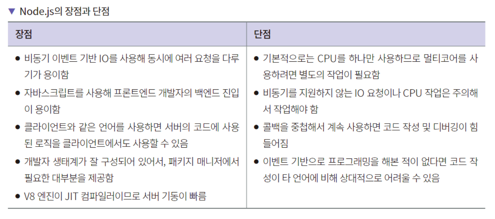
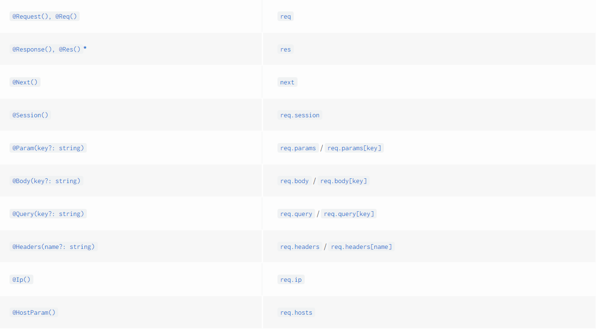
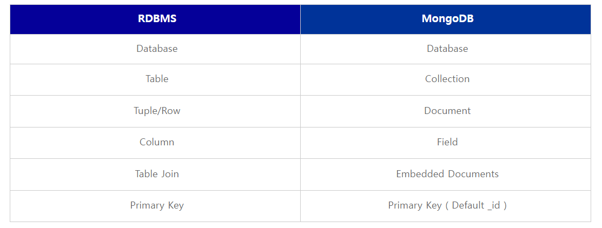

# BACK

## 목차
1. [Language](#Language)
2. [Framework BackEnd](#Framework-BackEnd)
3. [NoSQL](#NoSQL)

### Language
#### Node.js
- Node.js는 자바스크립트 코드 실행에 필요한 런타임으로 V8 엔진을 사용하고, 자바스크립트 런타임에
  필요한 이벤트 루프 및 운영체제 시스템 API를 사용하는 데는 libuv 라이브러리를 사용한다.
- Node.js의 특징
    - 싱글 스레드
        - 자바스크립트 엔진(V8)은 자바스크립트를 실행하는 힙과 콜 스택을 가지고 있다. 콜 스택이 하나이 하나이므로 한 번에 하나의 작업만 가능하다.
    - 이벤트 기반 아키텍처
        - 싱글 스레드의 문제를 해결하기 위해 이벤트 기반 아키텍처를 적용했다. 콜 스택에 쌓인 작업을 다른 곳에서 처리한 다음 처리가 완료되면 알림을 받는다.
        1. 동시 요청이 발생하는 경우 V8 콜 스택에 쌓이고 I/O 처리가 필요한 코드는 이벤트 루프로 보낸다.
        2. 이벤트 루프에서는 루프를 실행하면서 운영체제 또는 스레드 워커에 I/O 처리를 맡긴다.
        3. 받은 요청에 대한 결과를 이벤트 루프로 돌려주고 이벤트 루프에서는 결과값에 대한 코드를 콜스택에 다시 추가한다.
- Node.js의 장단점
  
- node에서 mongoose를 사용할 시, 쿼리에 필터를 빈 객체인 {}로 넣으면 모든 값을 불러오게 되어서
  문제가 되는 경우가 있다. 이 경우 에러를 내도록 하는 설정이 strictQuery 설정이다. Mongoose6에서는
  기본값이 true이며 7에서는 false이다. 명시적으로 설정해주지 않으면 서버 기동 시 경고가 발생한다.
  ```
  const mongoose = require("mongoose");
  
  mongoose.set("strictQuery", false);
  ```

#### Java
- 자료구조
    - 배열과 리스트
        - 배열
            - 배열은 메모리의 연속 공간에 값이 채워져 있는 형태의 자료구조
            - 인덱스를 사용하여 값에 바로 접근 가능
            - 새로운 값을 삽입하거나 특정 인덱스에 있는 값을 삭제하기 어려움
            - 배열의 크기는 선언할 때 지정하며, 한 번 선언하면 크기를 늘리거나 줄일 수 없음
        - 리스트
            - 값과 포인터를 묶은 노드를 포인터로 연결한 자료구조
            - 인덱스가 없음
            - 포인터로 연결되어 있어 데이터를 삽입하거나 삭제하는 연산 속도가 쁘름
            - 크기가 가변적
    - 스택과 큐
        - 스택
            - 삽입과 삭제 연산이 후입선출(Last-in First-out)
            - push : top 위치에 새로운 데이터 삽입
            - pop : top 위치에 현재 있는 데이터를 삭제하고 확인
            - peek : top 위치에 현재 있는 데이터를 단순 확인
        - 큐
            - 삽입과 삭제 연산이 선입선출(First-in First-out)
            - add : rear 위치에 새로운 데이터 삽입
            - poll : front 위치에 있는 데이터를 삭제하고 확인
            - peek : front 위치에 있는 데이터를 단순 확인
            - 우선순위 큐 (Priority Queue) : 값이 들어간 순서와 상관 없이 우선순위가 높은 데이터가 먼저 나오는 자료구조

<hr />

### Framework BackEnd
#### EXPRESS
- HTTP에서 Body를 파싱하려면 bodyParser.json() 미들웨어를 추가해야 한다.
  ```
  const express = require("express");
  const bodyParser = require("body-parser");
  
  const app = express();
  app.use(bodyParser.json());
  ```
- EXPRESS에서의 3계층 아키텍처
  
- 미들웨어
    - 익스프레스에서 미들웨어란 HTTP 요청과 응답 사이에 함수를 추가하여 새로운 기능을 추가하는 것을
      뜻한다.
<hr />

#### NestJS
- INRTODUCTION
    - 설치법
      ```
        $ npm i --save @nestjs/core @nestjs/common rxjs reflect-metadata
      ```
- OVERVIEW
    - Controllers
        - Routing
            - @Controller()는 기본 컨트롤러를 정의하는데 필요한 decorator이다.
            - ```
        import { Controller, Get } from '@nestjs/common';

        @Controller('cats')
        export class CatsController {
           @Get()
           findAll(): string {
              return 'This action returns all cats';
           }
        }
        ```
            - findAll() method 앞의 @Get() HTTP request mehthod decorator는 Nest에게 HTTP request에게 특정 엔드포인트에 대한
              핸들러를 만들라고 지시한다.
        - Request object
            - 아래는 제공된 데코레이터들의 리스트와 일반적인 object 들이다.
              
        - Status code
            - 응답 상태 코드는 POST 요청인 201을 제외하고는 기본적으로 항상 200이다. 핸들러 레벨에서 @HttpCode(...) 데코레이터를 추가하여
              동작을 쉽게 바꿀 수 있다.
            - ```
        @Post()
        @HttpCode(204)
           create() {
           return 'This action adds a new cat';
        }
        ```
    - Providers
        - Providers는 Nest의 기본적인 컨셉이다. 기본 Nest 클래스 중 상당수(services, repositories, factories, helpers 등) 이 Provider
          로 취급된다.
    - Modules
        - module은 @Module() 데코레이터로 주석이 달린 클래스이다. @Module()은 Nest가 어플리케이션 구조를 구성하는데 사용하는 메타데이터를 제공한다.
          각각의 어플리케이션은 적어도 하나의 module을 지니는데 root module이다. root module은 Nest가 어플리케이션 그래프(Nest가 모듈과 공급자의
          관계 및 의존성을 해결하는데 사용하는 내부 데이터 구조)를 구성하기 위해 사용하는
          시작점이다.
- 기타
    - 익스프레스와 NestJS 비교
      
    - NestJS의 핵심 기능으로 의존성 주입을 들 수 있다. 의존성 주입은 모듈 간의 결합도를 낮춰서 코드의
      재사용을 용이하게 한다. 즉, 모듈 내에서의 코드의 응집도는 높여서 모듈의 재사용을 꾀하고 모듈
      간에는 결합도를 낮춰서 다양한 아키텍처에서 활용할 수 있게 해준다. 이를 위한 장치들로 모듈, 가드,
      파이프, 미들웨어, 인터셉터 같은 모듈과 코드의 의존 관계를 구성하는 프로그래밍적 장치들이 있다.
    - NestJS에서는 HTTP 요청을 보통 가드 -> 인터셉터 -> 파이프 -> 컨트롤러 -> 서비스 -> 리포지토리
      순서로 처리한다.
<hr />

#### SPRING
- 기타
    - FILTER
        - GenericFilterBean과 OncePerRequestFilter의 차이
            - 개요
                - GenericFilter와 OncePerRequestFilter는 둘 다 대상을 필터로 등록해주는 인터페이스이다.
            - Filter 동작 흐름
                - Filter는 javax.servlet-api나 tomcat-embed-core를 사용하면 제공되는 Servlet Filter Interface로써 클라이언트의 서블릿 요청을 가장 먼저 받는다.
                - 서블릿이 호출되기 전에 Before를 출력하고 필터를 거쳐서 서블릿이 호출되면 After가 출력된다.
                - 이러한 Filter를 확장하여 Spring의 설정정보를 가져올 수 있게 만들어진 것이 GenericFilterBean이다.
                - Filter와 GenericFilterBean은 둘 다 매 서블릿마다 호출이 된다.
                - 서블릿은 사용자의 요청을 받으면 서블릿을 생성해 메모리에 저장해두고, 같은 클라이언트의 요청을 받으면 생성해둔 서블릿 객체를 재활용하여 요청을 처리한다.
                - 문제는 이 서블릿이 다른 서블릿으로 dispatch되는 경우이다.
                - 가장 대표적으로 Spring Security에서 인증과 접근 제어 기능이 Filter로 구현되는데 이러한 인증과 접근 제어는 RequestDispatcher 클래스에 의해 다른 서블릿으로 dispatch 되고, 이 때 이동할 서블릿에 도착하기 전에 다시 한번 filter chain을 거치게 된다.(Target API1 -> Target API2)
                - 한 번의 요청에 한 번의 인증 처리만 하면 되는데 불필요하게 여러번 중복되어 인증처리를 하게 되는 것이다.
                - 이런 문제를 해결하기 위해 등장한 것이 모든 서블릿에 일관된 요청을 처리하기 위해 만들어진 OncePerRequestFilter이다.
                - 이 추상 클래스를 구현한 필터는 사용자의 한 번의 요청 당 딱 한 번만 실행되는 필터를 만들 수 있다.
<hr />

### NoSQL
#### MongoDB
- 몽고디비에서 도큐먼트는 BSON이라는 데이터 포맷이다. BSON은 'Binary JSON'의 의미로 JSON을
  바이너리 형식으로 저장하는 형태이다.
- 몽고db 장단점
  
- 몽고db 구조 </br>
  
    - database
        - 데이터베이스는 컬렉션의 물리적 컨테이너 이다. 하나의 데이터베이스에는 보통 여러개의 컬렉션을 가지고 있다.
    - Collection
        - 컬렉션은 몽고DB의 Document의 그룹이며 RDBMS의 예를 들면 Table과 개념이 유사하다.
    - Document
        - Document는 하나의 키와 값의 집합으로 이루어져 있으며 동적 스키마이다.
        - 동적 스키마는 동일한 컬렉션 내의 도큐먼트가 동일한 필드 또는 구조를 가질 필요가 없음을 의미한다.
          또한, 동일한 필드안에 다른타입의 데이터를 보유할 수 있음을 의미한다.
- 몽고디비와 RDBMS의 구조 비교
  

<hr />