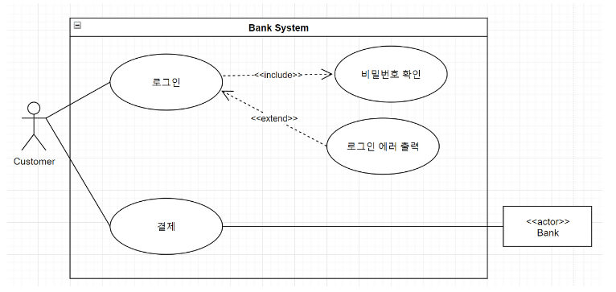

# CS

## 목차
1. [Software Engineering](#Software-Engineering)
   1. [UML](#UML)

### Software Engineering
#### UML
##### 유스케이스 다이어그램
- 사용자(Actor)의 관점에서 시스템의 기능, 상호작용과 그들간의 관계를 표현한다.
- 사용하는 이유
    - 제품과 상호작용하여 얻을 수 있는 목표를 자세히 설명할 수 있다.
    - 시스템의 요구사항을 요약하고 정의할 수 있다.
    - 시스템 이벤트의 기본적인 흐름을 모델링할 수 있다.
- 구성요소
    1. 시스템(System)
        - 개발하고자 하는 것 그 자체이며, 웹사이트가 될 수도 있고, 소프트웨어
          컴포넌트, 애플리케이션 등 다양한 시스템이 될 수 있다.
        - 사각형의 형태로 표시하고, 상단에 시스템의 이름을 정의한다.
    2. 액터(Actor)
        - 시스템 외부에서 시스템과 상호작용하여 특정한 목적을 취하는 객체를 뜻한다.
        - 액터는 사람이 될 수도 있고, 회사, 다른 시스템, 또는 외부 장비가 될 수도 있다.
        - 액터는 두가지 종류가 있다.
    3. 유스케이스(Use Cases)
        - 시스템 내에서 일련의 작업을 수행하기 위한 행위들을 나타내며, 타원형으로 표기한다.
    4. 관계(Relationships)
        - 선 또는 화살표로 나타내며, 이어진 2개의 액터 또는 유스케이스들이 서로 상호
          작용함을 나타낸다
        - 관계는 총 4가지 종류가 있다.
            1. 연관 관계(Association)
                - 유스케이스와 액터 사이에 상호작용이 있다는 뜻으로, 실선으로 표시한다.
                  
            2. 포함 관계(Include)
                - 포함 관계는 두 유스케이스 간의 의존성을 나타낸다.
                  
            3. 확장 관계(Extend)
                - 확장 관계는 두개의 유스케이스 간의 확장성을 나타낸다.
                - 하나의 유스케이스가 실행될 때 포함 관계에 있는 유스케이스가 특정 상황에서만 실행된다는 뜻이다.
                  
            4. 일반화 관계(Generalization)
                - 일반화 관계는 부모 유스케이스와 자식 유스케이스들 간의 상속관계를 나타낸다.
                  
                - 확장 관계와의 차이점
                    - 일반화 관계에 있는 자식 유스케이스들은 부모의 속성들을 물려받기 때문에, 부모 유스케이스가
                      해당된 모든 포함, 확장 관계를 만족해야 한다.
                    - 반면에 확장 관계에 있는 유스케이스는 속성을 물려받은 것이 아니므로, 기존 유스케이스와의
                      관계를 만족하지 않아도 된다.
- 작성 순서
    1. 시스템 정의: 시스템 영역과 이름을 정의한다.
    2. 액터 정의: 사용자를 정의한다. 시스템과 상호작용하는 외부 시스템을 정의한다.
    3. 유스케이스 정의: Actor가 요구하는 서비스를 식별한다. Actor들이 시스템과 상호작용하는 행위를 식별한다.
    4. 관계 정의: Actor와 Actor 사이의 관계를 정의한다. Actor와 유스케이스 사이의 관계를 정의한다. 유스케이스 간의 관계를 정의한다.
    5. 유스케이스 구조화: 두 개 이상의 유스케이스의 공통된 서비스를 추출하여 일반화시킨다.

#### 클래스 다이어그램
- 클래스 내부의 정적인 내용이나 클래스 사이의 관계를 표기하여 시스템의 일부 또는 전체의 구조를 나타낸다.
- 사용하는 이유
    - 의존 관계를 명확하게 나타낼 수 있다.
- 구성요소
    1. 클래스(Class)
    - 3개의 구획으로 나뉘어 클래스의 이름, 속성, 기능을 표기한다. 속성과 기능은 옵션이지만 클래스명은 필수이다.
    - 필드와 메서드의 접근제한자, 필드명/메서드명, 데이터 타입, 매개변수 타입, 리턴 타입 등을 나타낼 수 있다.
    2. 관계(Relationships)
        - 선 또는 화살표로 나타내며, 클래스 다이어그의 주 목적이 클래스 간의 의존을 한 눈에 파악할 수 있도록 하는 것이기 때문에 매우 중요하다.
        - 관계는 총 7가지 종류가 있다.
            1. 읾반화 관계(Generalization)
            - 부모 클래스와 자식 클래스 간 상속 관계를 나타낸다. 클래스를 실선으로 연결하고 부모 클래스 쪽에 비어있는 삼각형으로 나타낸다.
            2. 실체화 관계(Realization)
            - 인터페이스의 spec(명세, 정의)만 있는 메서드를 오버라이딩하여 구현하는 것이다. 점선과 인테페이스 쪽에 비어있는 삼각형으로 나타낸다.
            3. 의존 관계(Dependency)
            - 어떤 클래스가 다른 클래스를 참조하는 경우이다. 점선과 대상 클래스 쪽에 열려있는 화살표로 나타낸다.
            - 참조의 형태는 메서드 내에서 대상 클래스의 객체 생성, 객체 사용, 메서드 호출, 객체 리턴, 매개 변수로 해당 객체를 받는 것 등이다.
            4. 5. 연관 관계(Association), 직접 연관 관계(Directed Association)
            - 일반적인 연관 관계는 실선 하나로 연결한다. 서로 참조할 수 있다.
            - 직접 연관 관계는 실선과 참조 당하는 쪽에 열려있는 화살표로 나타낸다. 방향성으로 참조하는 쪽과 참조 당하는 쪽을 구분할 수 있다.
            - Multiplicty(개수)로 대상 클래스의 가질 수 있는 인스턴스 개수 범위를 나타낸다.
            6. 집합 관계(Aggregation)
                - 연관 관계를 더 특수한 경우로 나타낸 것으로, 전체와 부분의 관계를 가진다. 전체(whole)와 부분(part)을 실선으로 연결 후,
                  전체 쪽에 비어있는 다이아몬드로 표기한다.
            7. 합성, 복합 관계(Composition)
                - Aggregation보다 강한 집합을 의미한다. 전체(whole)와 부분(part)를 실선으로 연결 후, 전체 쪽에 채워진 다이아몬드를,
                  부분 쪽엔 열려있는 화살표를 나타낸다.
                - 부분이 전체에 종속적이다. 전체 class가 복사되는 경우 부분 class도 복사된다.
- 작성 순서
    - 클래스 정의 : 객체를 식별하고 클래스를 정의한다.
    - 속성, 기능 정의 : 클래스의 속성과 기능(동작)을 정의한다.
    - 관계 정의 : 클래스 간의 관계를 정의한다.
