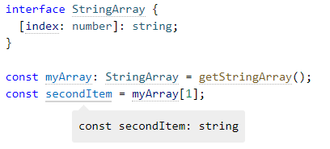
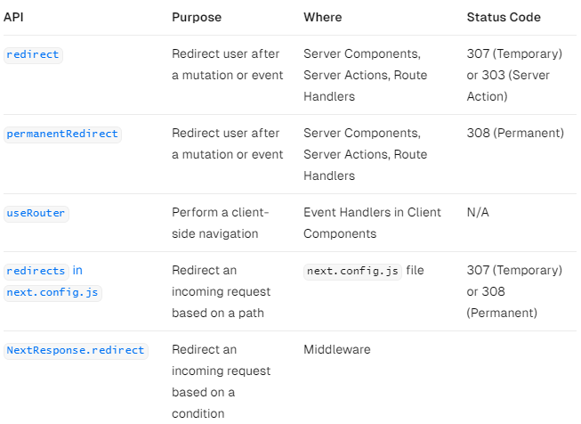
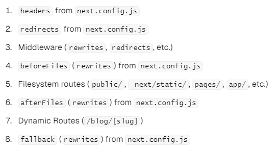
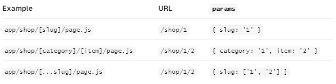
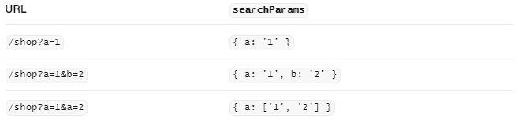
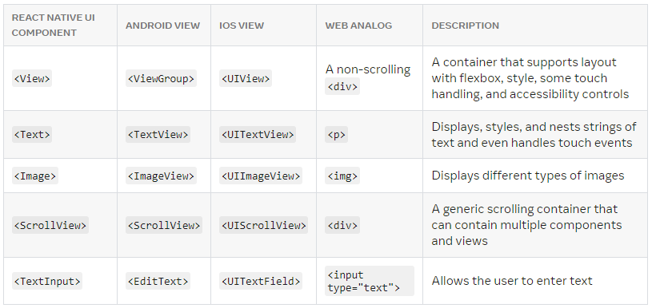

# FRONT

## 목차
1. [INTERNET](#INTERNET)
2. [HTML](#HTML)
3. [CSS](#CSS)
4. [JavaScript](#JavaScript)
5. [Package Manager](#Package-Manager)
6. [Framework](#Framework)
7. [Writing CSS](#Writing-CSS)
8. [Testing](#Testing)
9. [Type Checkers](#Type-Checkers)
10. [Server Side Rendering](#Server-Side-Rendering)
11. [Mobile Applications](#Mobile-Applications)

### INTERNET
#### HTTP
- HTTP
    - HTTP
    - 가이드
        - HTTP 캐싱
            - 웹 사이트와 애플리케이션의 성능은 이전에 가져온 리소스들을 재사용함으로써 현저하게 향상될 수 있다.
              웹 캐시는 레이턴시와 네트워크 트래픽을 줄여줌으로써 리소스를 보여주는 데에 필요한 시간을 줄여준다. HTTP 캐싱을 활용하면 웹 사이트가
              좀 더 빠르게 반응하도록 만들 수 있다.
            - 다른 종류의 캐시들
                - 캐싱은 주어진 리소스의 복사본을 저장하고 있다가 요청 시에 그것을 제공하는 기술이다.
                - 캐시에는 몇 가지 종류가 있다: 크게 사설 혹은 공유 캐시 두 가지 부류로 분류될 수 있다. 공유 캐시는
                  한 명 이상의 사용자가 재사용할 수 있도록 응답을 저장하는 캐시를 말한다. 사설 캐시는 한 명의
                  사용자만 사용하는 캐시를 말한다. 여기서는 거의 대부분 브라우저와 프록시 캐시에 대해서만 다룰 것이나, 그외에도 더 나은
                  신뢰도, 성능 그리고 웹 사이트와 웹 애플리케이션의 확장을 위해 웹 서버 위에 배포되는 게이트웨이 캐시, CDN, 리버스 프록시 캐시
                  그리고 로드 밸런서 등이 있다.
                    - 사설 브라우저 캐시
                        - 브라우저 캐시는 그 사용자에 의하여 HTTP를 통해 다운로드된 모든 문서들을 가지고 있다. 이 캐시는
                          서버에 대한 추가적인 요청 없이 뒤로 가기나 앞으로 가기, 저장, 소스로 보기 등을 위해 방문했던 문서들을
                          사용할 수 있도록 해준다.
                    - 공유 프록시 캐시
                        - 당신의 회사의 ISP는 많은 사용자들을 서비스하기 위해 지역 네트워크 기반의 일부분으로서 웹 프록시를 설치해뒀을 수도 있는데,
                          그 덕분에 조회가 많이 되는 리소스들은 몇 번이고 재사용되어 네트워크 트래픽과 레이턴시를 줄여준다.
            - 캐싱 동작의 대상
                - HTTP 캐싱은 선택적 이지만 캐시된 리소스를 재사용하는 것은 보통 바람직한 일이다. 하지만, HTTP 캐시들은 일반적으로
                  GET에 대한 응답만을 캐싱하며, 다른 메서드들을 제외된다. 기본 캐시 키는 요청 메서드 그리고 대상 URI로
                  구성된다(GET 요청만을 대상으로 하므로 URI만 사용되는 경우가 많다). 일반적인 캐싱 엔트리의 형태는 다음과 같다.
                    - 검색(rerieval) 요청의 성공적인 결과: HTML 문서, 이미지 혹은 파일과 같은 리소스를 포함하는 GET 요청에 대한
                      200(OK) 응답
                    - 영구적인 리다이렉트: 301(Moved Permanently) 응답
                    - 오류 응답: 404(Not Found) 결과 페이지
                    - 완전하지 않은 결과: 206(Partial Content) 응답
                    - 캐시 키로 사용하기에 적절한 무언가가 정의된 경우의 GET 이외의 응답
                - 캐시 엔트리는 요청이 컨텐츠 협상의 대상인 경우, 두번째 키에 의해 구별되는 여러 개의 저장된 응답들로 구성될 수도 있다.
            - 캐싱 제어
                - Cache-control 헤더
                    - Cache-Control HTTP/1.1 기본 헤더 필드는 요청과 응답 양측 모두에 있어 캐싱 메커니즘을 위한 디렉티브를 지정하는데 사용된다.
                      이 헤더 필드가 제공하는 여러 디렉티브들로 캐싱 정책을 정의하고자 한다면 이 헤더를 사용할 것
                    - 캐시하지 않음
                        - 캐시는 클라이언트 요청 혹은 서버 응답에 관해서 어떤 것도 저장해서는 안된다. 요청은 서버 측으로 전송되고 전체 응답은 매번
                          다운로드 된다.
                        - `Cache-Control: no-store`
                    - 캐시하지만 재검증
                        - 캐시된 복사본을 사용자에게 릴리즈 하기 전에, 유효성 확인을 위해 원 서버로 요청을 보낸다.
                        - `Cache-Control: no-cache`
                    - 사설 캐시와 공개 캐시
                        - "public" 디렉티브는 응답이 어떤 캐시에 의해서든 캐시되어도 좋다는 것을 가리킨다. 이것은 HTTP 인증, 혹은 보통 캐시 가능하지
                          않은 응답 상태 코드를 지닌 페이지가 이제 캐시되어야 할 경우 유용할 수 있다.
                        - 반면 "private"은 응답이 단일 사용자만을 위한 것이며 공유 캐시에 의해 저장되어서는 안된다는 것을 가리킨다.
                          사설 브라우저 캐시는 이런 경우에 응답을 저장할 수 있다.
                        - ```
              Cache-Control: private
              Cache-Control: public
              ```
                    - 만료
                        - `Cache-Control: max-age=31536000`
                - Pragma 헤더
    - 레퍼런스

### HTML
- SEO Basics
    - search engine optimization : 검색 엔진 최적화
    - 웹 페이지 검색 엔진이 자료를 수집하고 순위를 매기는 방식에 맞게 웹 페이지를 구성해서 검색 결과 상위에 노출되도록 최적화한다.
    - 유료 비용이 들지 않으며, 주요한 마케팅 방법 중 하나이다.
    - 검색 엔진 최적화를 위한 작업
        - 메타 태그
            - `<title>` : 검색 결과로 노출되는 제목
            - `<description>` : 해당 웹 페이지를 요약한 간략한 문장
            - `<robots>` : 로봇의 접근 여부 설정
            - `<canotical>` : 해당 페이지의 대표 URL
        - 오픈 그래프 태그
            - SNS에서 공유될 시 어떻게 노출될지 정의해주는 것
            - 아래와 같이 작성한다.
              ```
                <meta content="website" property="og:type">
                /* property options 
                   og:title
                   og:description
                   og:image
                   og:type
                   og:url
                */
              ```

### CSS
- 반응형 웹
    - 반응형 웹이란 PC, TV, 내비게이션, 스마트 기기 등 기기마다 또는 환경마다 최적화된 웹사이트를 제공해주는 것을 말한다.
    - 예를 들어 화면이 작은 기기에서 반응형 웹으로 제작된 웹사이트를 접속했을 때는 웹사이트의 구조를 작은 화면에 최적화된 구조로
      변경하여 보여주고, 큰 화면을 가진 기기에서는 웹사이트의 구조를 큰 화면에 최적화된 구조로 변경하여 보여준다.

### JavaScript
- References
    - Tutorials
        - intermediate
            - Closures
                - 클로저는 주변 상태(랙시컬 환경)를 참조하는 함수의 조합이다. 즉, 클로저는 내부 함수에서 외부 함수의 범위에
                  대한 엑세스를 제공한다. 자바스크립트에서는 함수가 생성될 때마다 클로저가 생성된다.
                - Lexical scoping
                    - 다음 예시 코드를 살펴보자.
                    - ```
            function init() {
               var name = "Mozilla"; // name is a local variable created by init
               function displayName() {
                  // displayName() is the inner function, that forms the closure
                  console.log(name); // use variable declared in the parent function
               }
               displayName();
               }
            init();
            ```
                    - init()은 로컬 변수인 name과 displayName()이라는 함수를 만들었다. displayName() 함수는
                      init() 안에 정의되어 있고, init() 함수 안에서만 유효하다. displayName() 함수에는 지역변수가 없다.
                      그러나, 내부 함수는 외부 함수의 변수에 접근할 수 있으므로, displayName()은 부모 함수인 init()에 선언된
                      name 변수에 접근할 수 있다.
                    - 이것이 함수가 중첩될 때, 파서가 변수 이름을 결정하는 방법을 설명하는 렉시컬 스코프의 예이다.
                      lexical이라는 단어는 렉시컬 스코프가 변수가 사용될 위치를 결정하기 위해 소스코드 내에서 선언된 위치를 사용한다는 사실을
                      보여주고 있다. 중첩된 함수는 외부 범위에 선언된 변수에 접근할 수 있다.
                    - 위 예에서 스코프는 function scope라고 한다. 변수가 접근가능하고, 선언된 함수 내에서만 접근 가능하기 때문이다.
                    - Scoping with let and const
                        - ES6 이전에 자바스크립트는 function scope와 global scope 둘만 존재하였다.
                          변수 선언을 var로 했을 시, 함수 내부냐 외부냐에 따라 function-scope, global-scope로 나뉘어졌다. 중괄호가 있는 블록은
                          scope를 생성하지 않기 때문에 다루기가 까다롭다.
                        - ```
              if (Math.random() > 0.5) {
                var x = 1;
              } else {
                var x = 2;
              }
              console.log(x);
              ```
                        - 블록이 scope를 생성하는 다른 언어(C, JAVA 등) 사용자의 경우, 두 블록 모두에서 x의 범위를 벗어나기 때문에 위 코드에서 console.log는 에러를 낸다.
                          그러나, 블록은 var에 대한 scope를 생성하지 않기 때문에, 여기의 var 문은 전역 변수를 생성한다.
                        - ES6에서는 temporal dead zones과 같은 block-scope를 생성할 수 있는 let과 const 선언문을 소개하고 있다.
                        - ```
              if (Math.random() > 0.5) {
                const x = 1;
              } else {
                const x = 2;
              }
              console.log(x); // ReferenceError: x is not defined
              ```
                - Closure
                    - 다음 예시 코드를 확인하자.
                    - ```
            function makeFunc() {
              const name = "Mozilla";
              function displayName() {
                console.log(name);
              }
              return displayName;
              }
            
            const myFunc = makeFunc();
            myFunc();
            ```
- Guides
- 기타
    - 일반 함수과 화살표 함수에서 this의 차이
        - 일반 함수는 자신이 종속된 객체를 this로 가리키며, 화살표 함수는 종속된 인스턴스를 가리킨다.
          ```
          function BlackDog() {
            this.name = '흰둥이';
            return {
              name: '검둥이',
              bark: function() {
                console.log(this.name + ': 멍멍!');
              }
            }
          }
        
          const blackDog = new BlackDog();
          blackDog.bark(); // 검둥이: 멍멍!
        
          function WhiteDog() {
            this.name = '흰둥이';
            return {
              name: '검둥이',
              bark: () => {
                console.log(this.name + ': 멍멍!');
              }
            }
          }
        
          const whiteDog = new WhiteDog();
          whiteDog.bark(); // 흰둥이: 멍멍!
          ```
    - 화살표 함수는 따로 {}를 열어 주지 않으면 연산한 값을 그대로 반환한다는 의미이다.
      ```
      const triple = (value) => value * 3;
      ```
    - 자바스크립트에서 함수는 일급 객체다. 즉, 객체를 다루듯이 함수를 변수에 할당하거나, 함수를 다른 함수로
      전달하거나, 함수에서 함수를 반환하거나, 객체와 프로토타입에 할당하거나, 함수에 프로퍼티를 기록하거나,
      함수에 기록된 프로퍼티를 읽는 등의 작업을 할 수 있다.
    - 비동기 처리
        - 자바스크립트는 런타임에서 싱글 스레드로 동작하기 때문에 비동기 처리를 위해서는 콜백(callback), 프로미스(promise), 어싱크 어웨이트(async await) 방식을 사용한다.
        - 콜백
            - 함수의 파라미터로 함수를 전달
            - 가독성이 좋지 못하여 유지보수 및 디버깅이 힘들다.
        - 프로미스
            - 비동기 작업이 완료되면 결과를 반환하는 객체
            - then(), catch() 메서드를 사용하여 성공과 실패에 대한 처리가 가능하다.
        - 어싱크 어웨이트
            - 프로미스를 사용하는 비동기 작업을 동기적으로 처리하는 것처럼 코드를 작성할 수 있다.
            - async가 붙어 있는 함수를 실행할 때 await 키워드를 사용하여 비동기 작업이 완료될 때까지 기다릴 수 있다.
            - ```
        async function myName() {
          return "Andy";
        }
      
        async function showName() {
          const name = await myName(); // await는 promise 객체인 myName() 함수의 실행이 끝나길 기다린다.
          console.log(name);
        }
      
        console.log(showName());
        ```
    - 전개 연산자(...문법)를 사용하여 객체나 배열 내부의 값을 복사할 때는 얕은 복사를 하게 된다. 즉, 내부의
      값이 완전히 새로 복사되는 것이 아니라 가장 바깥쪽에 있는 값만 복사된다. 따라서 내부의 값이 객체 혹은
      배열이라면 내부의 값 또한 따로 복사해 주어야 한다.
      ```
      const todos = [{id: 1, checked: true}, {id:2, checked: true}];
      const nextTodos = [...todos];
    
      nextTodos[0].checked = false;
      console.log(todos[0] === nextTodos[0]); // 아직까지는 똑같은 객체를 가리키고 있기 때문에 true
    
      nextTodos[0] = {
        ...nextTodos[0],
        checked: false
      };
      console.log(todos[0] === nextTodos[0]); // 새로운 객체를 할당해 주었기에 false
      ```
    - immer를 사용하면 불변성을 유지하는 작업을 매우 간단하게 처리할 수 있다.
      ```
      import produce from 'immer';
      const nextState = produce(originalState, draft => {
        // 바꾸고 싶은 값 바꾸기
        draft.somewhere.deep.inside = 5;
      })
      ```
    - module.exports와 exports의 관계
        - 기본적으로 module.exports, exports 모두 하나의 객체를 바라보고 있는데, 최종적으로 return 되는 것은
          무조건 module.export이다.
        - 만약 exports에 다른 객체를 할당하게 되면, module.exports의 객체와 달라지게 되고, exports에 어떤 변경을 해도 모듈에는 영향을 주지 못한다.
          ```
            var module = {
                  exports: {}
            }
            var exports = module.exports;
          
            return module.exports;
          ```

<hr />

### Package-Manager
- 패키지 매니저는 프로젝트에 필요한 의존성 패키지를 관리하는 프로그램을 의미한다.
    - 의존성 패키지는 해당 프로젝트를 실행하는 데 꼭 필요한 라이브러리와 모듈들이다.
#### npm
- npm은 자바스크립트용 패키지 매니저이다. 유저가 만든 패키지를 등록하는 저장소를 의미하기도 하고
  CLI를 의미 하기도 한다. Node.js를 설치할 때 함께 설치된다.
- 설치 명령어
  ```
  npm install [<@scope>/]<name>@<tag/version/version range>
  npm i
  npm add
  ```
- package-lock
    - package.json에 버전을 설정할 때 특정 버전이 아닌 버전 범위를 설정하면 패키지를 설치하는 시점에 따라 다른 버전이 설치된다.
      하위 호환에 대한 검증을 진행하지 않기 때문에 문제가 발생할 수 있어 설치 시 올바르게 동작하는 버전을 고정하는 이데 대한 패키지의
      의존성 트리를 package-lock.json에 저장해둔다.

#### yarn

<hr />

### Framework
#### React
- 네이밍 규칙
    - 컴포넌트가 단일 파일로 구성되는 경우 파일 이름은 대문자로 시작해야 한다.
      `MyComponent.js`와 같이 작성하며, 이는 해당 파일이 React 컴포넌트를 정의하고 있다는 것을 명시적으로 나타내기 위함이다.
    - 일반적인 JavaScript 함수 또는 유틸리티 함수를 정의하는 파일은 소문자로 시작한다. `helperFunctions.js`와 같이 소문자로 시작한다.
      ```
      const add = (a, b) => {
        return a + b;
      };
      
      export { add };
      ```
- 클래스형 컴포넌트와 함수형 컴포넌트

| 기능      | 클래스형 컴포넌트      | 함수형 컴포넌트  |  
|---------|----------------|-----------|
| state   | 사용 가능          | 사용 불가능    |
| 라이프 사이클 | 라이프 사이클 API 사용 | hooks 사용  |
| 자원 사용   | 비교적 많이 사용      | 비교적 적게 사용 |

- JSX 코드는 브라우저에서는 직접 해석할 수 없으므로, 웹팩에 의해 자바스크립트 코드로 변환된다.
  이때, JSX로 구현된 컴포넌트는 자바스크립트의 객체로 표현된다. 변환된 자바스크립트 코드를
  브라우저가 읽어서 실행하고 화면을 그리기 시작한다.
- 리액트에서 DOM 요소에 스타일을 적용할 떄는 문자열 형태로 넣는 것이 아니라 객체 형태로
  넣어 주어야 한다. 스타일 이름 중에서 background-color처럼 - 문자가 포함되는 이름이 있으면,
  하이픈(-) 문자를 없애고 카멜 표기법으로 작성해야 한다.
- directives (지시어)
    - `use client`
        - 클라이언트에서 실행되는 코드를 표시
        - 명시된 컴포넌트에 국한되지 않고 하위 계층까지 클라이언트 번들로 간주된다.
    - `use server`
        - 클라이언트 사이드에서 호출할 수 있는 서버 사이드 함수임을 표시
- component
    - 라이프사이클 메서드 흐름
      
- Hooks
    - 상태 훅
        - useState
        - useEffect
        - useReducer
            - userReducer()의 반환값 배열의 첫 번째는 현재 상태, 두 번째는 dispatch 함수이다.
              dispatch 함수에 action을 전달함으로써 상태를 업데이트할 수 있다.
            - reducer가 현재 상태와 action을 기반으로 다음 상태를 결정한다.
              ```
              impport {useReducer} from 'react';
              
              function reducer(state, action) {
                // action.type에 따라 다른 작업 수행
                switch (action.type) {
                  case 'INCREMENT':
                    return { value: state.value + 1 };
                  case 'DECREMENT':
                    return { value: state.value - 1 };
                  default:
                    // 아무것도 해당되지 않을 떄 기존 상태 반환
                    return state;
                }
              }
              
              const Counter = () => {
                const [state, dispatch] = useReducer(reducer, { value: 0 });
              
                return (
                  <div>
                    <p>
                      현재 카운터 값은 <b>{state.value}</b>입니다.
                    </p>
                    <button onClick={() => dispatch({ type: 'INCREMENT' })}>+1</button>
                    <button onClick={() => dispatch({ type: 'DECREMENT' })}>-1</button>
                  </div>
                );
              };
              ```
            - useReducer를 사용했을 때의 가장 큰 장점은 컴포넌트 업데이트 로직을 컴포넌트 바깥으로
              빼낼 수 있다는 점이다.
    - 메모이제이션 훅
        - useMemo
        - useCallback
            - useMemo는 특정 결과값을 재사용 할 때 사용하는 반면, useCallback은 특정 함수를 새로 만들지 않고
              재사용하고 싶을 때 사용한다.
    - 라우팅 관련 훅
        - useParams
        - useSearchParams
    - useContext
        - useContext는 컴포넌트에서 context를 읽고 구독할 수 있게 해주는 리액트 hook이다.
    - 기타
        - useRef
            - 함수 컴포넌트에서 ref를 쉽게 사용할 수 있도록 한다. useRef를 사용하여 ref를
              사용하여 ref를 설정하면 useRef를 통해 만든 객체 안의 current 값이 실제 엘리먼트를 가리킨다.
            - 컴포넌트 로컬 변수를 사용해야 할 때도 useRef를 활용할 수 있다. 여기서 로컬 변수란
              렌더링과 상관없이 바뀔 수 있는 값을 의미한다.
            - useRef의 주요 이점
                1. DOM 요소에 접근
                - 가장 일반적으로 'useRef'는 함수 컴포넌트에서 DOM 요소에 접근하는 데 사용된다. 'useRef'로 생성한
                  객체의 'current'속성을 통해 해당 DOM 요소에 직접 접근 가능
                  ```
                   import React, { useRef, useEffect } from 'react';
       
                   const MyComponent = () => {
                      const myRef = useRef(null);
                      
                      useEffect(() => {
                         // myRef.current를 통해 DOM 요소에 접근
                         console.log(myRef.current);
                      }, []);
                      
                      return <div ref={myRef}>Hello, World!</div>;
                   };
                  ```
                2. 컴포넌트 간 통신
                - 'useRef'는 컴포넌트 간에 값을 공유하고 통신하는 데에도 사용될 수 있다. 예를 들어, 자식 컴포넌트에서 부모
                  컴포넌트의 상테를 업데이트하고 싶을 때 활용할 수 있다.
                  ```
                    import React, { useRef } from 'react';
      
                    const ParentComponent = () => {
                       const sharedValueRef = useRef('initial value');
                       
                       const ChildComponent = () => {
                          // 부모 컴포넌트의 ref를 통해 값 읽기
                          console.log(sharedValueRef.current);
                       
                          // 부모 컴포넌트의 ref를 통해 값 업데이트
                          sharedValueRef.current = 'new value';
                       };
                       
                       return (
                          <div>
                             <ChildComponent />
                          </div>
                       );
                    };
                  ```
                3. 컴포넌트 렌더링과 무관한 값 저장
                - 'useRef'에 저장된 값은 컴포넌트가 리렌더링될 때 변경되지 않는다. 따라서 'useRef'를 사용하면
                  값이 변경되더라도 컴포넌트가 다시 렌더링되지 않는다.
                  ```
                    import React, { useRef, useState } from 'react';
      
                    const MyComponent = () => {
                       const renderCount = useRef(0);
                       
                       // 컴포넌트 렌더링 횟수 증가 (재렌더링되어도 값이 유지됨)
                       renderCount.current += 1;
                       
                       const [state, setState] = useState('initial state');
                       
                       return (
                          <div>
                             <p>Render count: {renderCount.current}</p>
                             <button onClick={() => setState('new state')}>Update State</button>
                          </div>
                       );
                    };
                  ```
    - useCallback vs useEffect
        - useCallback
            - 콜백함수를 자식에게 전달해줄 때 사용
            - 자주 렌더링 위험이 있는 요소를 성능 최적화를 위해 사용
            - const onChange = useCallback(e => {...}); 이렇게 지정하고 자식에게 던진다
        - useEffect
            - 사이드 이펙트 방지를 위해 사용
            - API 통신(data fetch), 이벤트 리스너 추가, DOM 업데이트 등
            - useEffect(()=>{...}); 함수 호출을 통해, 실행한다
- default props & default parameter
    - 리액트 18.2 버전까지 방식 deprecated
      ```
      const GreetComponent = ({ name, age }) => (
        <div>{`Hello, my name is ${name}, ${age}`}</div>
      );
      GreetComponent.defaultProps = {name: 'oklee', age: 25};
      ```
    - 리액트 18.3 버전 이후
      ```
      const GreetComponent = ({ name = 'oklee', age = 25 }) => (
        <div>{`Hello, my name is ${name}, ${age}`}</div>
      );
      ```
- 컴포넌트 스타일링
    - 일반 CSS
    - Sass
        - 자주 사용되는 CSS 전처리기 중 하나로 확장된 CSS 문법을 사용하여 CSS 코드를 더욱 쉽게 작성할 수 있도록 해준다.
    - CSS Module
        - 스타일을 작성할 때 CSS 클래스가 다른 CSS 클래스의 이름과 절대 충돌하지 않도록 파일마다 고유한 이름을
          자동으로 생성해 주는 옵션이다.
    - styled-components
        - 스타일을 자바스크립트 파일에 내장시키는 방식으로 스타일을 작성함과 동시에 해당 스타일이 적용된 컴포넌트를
          만들 수 있게 해준다.
        - Tagged 템플릿 리터럴
            - 스타일을 작성할 때 `을 사용하여 만든 문자열에 스타일 정보를 넣을 수 있는데, 이 문법을 Tagged 템플릿 리터럴
              이라고 부른다. CSS Module에 사용하는 일반 템플릿 리터럴과 다른 점은 템플릿 안에 자바스크립트 객체나 함수를
              전달 할 때 온전히 추출할 수 있다는 것이다.
- 리액트 라우터
    - Outlet component
        - 이 컴포넌트는 Route의 children으로 들어가는 JSX 엘리먼트를 보여준다.
- context
    - Provider를 사용할 때 value를 명시하지 않으면 오류가 발생한다.
- 리덕스
    - 리덕스의 3가지 규칙
        1. 단일 스토어
            - 하나의 애플리케이션 안에는 하나의 스토어가 들어 있다.
        2. 읽기 전용 상태
            - 리덕스 상태는 읽기 전용이다. 상태를 업데이트 할 때 기존의 객체는
              건드리지 않고 새로운 객체를 생성해 주어야 한다.</br>
              리덕스에서 불변성을 유지해야 하는 이유는 내부적으로 데이터가 변경되는
              것을 감지하기 위해 얕은 비교 검사를 하기 때문이다.
              객체의 변화를 감지할 때 겉만 비교하여 좋은 성능을 유지할 수 있다.
        3. 리듀서는 순수한 함수
            - 변화를 일으키는 리듀서 함수는 순수한 함수여야 한다. 순수한 함수는
              다음 조건을 만족한다.
                1. 리듀서 함수는 이전 상태와 액션 객체를 파라미터로 받는다.
                2. 파라미터 외의 값에는 의존하면 안 된다.
                3. 이전 상태는 절대로 건드리지 않고, 변화를 준 새로운 상태 객체를
                   만들어서 반환한다.
                4. 똑같은 파라미터로 호출된 리듀서 함수는 언제나 똑같은 결과 값을
                   반환해야 한다.
- zustand
    - 리덕스와의 비교
        - 상태 모델
            - 개념적으로 Zustand와 Redux는 매우 유사하며 둘 다 불변 상태 모델을 기반으로 한다.
              그러나 Redux를 사용하려면 앱을 context provider로 래핑해야한다. zustand는 그렇지 않다.
        - 렌더링 최적화
            - 앱 내 렌더링 최적화와 관련하여 Zustand와 Redux의 접근 방식에는 큰 차이가 없다. 두 라이브러리 모두
              선택기를 사용하여 렌더링 최적화를 수동으로 적용하는 것이 좋다.

<hr />

### Writing CSS
#### Tailwind
- GETTING STARTED
    - Installation
        - Installing Tailwind CSS as PostCSS plugin
            - Install Tailwind via npm
                - `npm install -D tailwindcss@latest postcss@latest autoprefixer@latest`
            - Add Tailwind as a PostCSS plugin
                - ```
          // postcss.config.js
          module.exports = {
             plugins: {
                tailwindcss: {},
                autoprefixer: {},
             }
          }
          ```
            - Create your configuration file
                - `npx tailwindcss init`
                - ```
          // tailwind.config.js
          module.exports = {
             purge: [],
             darkMode: false, // or 'media' or 'class'
             theme: {
                extend: {},
             },
             variants: {},
             plugins: [],
          }
          ```
            - Include Tailwind in your CSS
                - ```
          /* ./your-css-folder/styles.css */
          @tailwind base;
          @tailwind components;
          @tailwind utilities;
          ```
            - Building your CSS
                - ```
            // tailwind.config.js
            module.exports = {
               purge: [
                  './src/**/*.html',
                  './src/**/*.js',
               ],
               darkMode: false, // or 'media' or 'class'
               theme: {
                  extend: {},
               },
               variants: {},
               plugins: [],
            }
          ```
- CORE CONCEPTS
- CUSTOMIZATION
- BASE STYLES
- LAYOUT
- FLEXBOX AND GRID

<hr />

### Testing
#### Testing Library
- Frameworks
    - DOM Testing Library
    - React Testing Library
        - Introduction
            - The problem
            - This solution
            - Tutorials

#### Jest

<hr />

### Type Checkers
#### TypeScript
- Get Started
    - TypeScript for JavaScript Programmers
        - 타입 추론
            - 타입스크립트는 자바스크립트 언어를 알고 있으며 대부분의 경우 타입을 생성해준다. 예를 들어 변수를 생성하면서
              동시에 특정 값에 할당하는 경우, 타입스크립트는 그 값을 해당 변수의 타입으로 사용할 것이다.
        - 타입 정의
            - 자바스크립트는 클래스와 객체 지향 프로그래밍을 지원하기 때문에, 타입스크립트 또한 동일하다 - 인터페이스는 클래스로도
              선언할 수 있다.
            - ```
          interface User {
            name: string;
            id: number;
          }
        
          class UserAccount {
            name: string;
            id: number;
        
            constructor(name: string, id: number) {
              this.name = name;
              this.id = id;
            }
          }
        
          const user: User = new UserAccount("Murphy", 1);
        ```
- Handbook
    - Object Types
        - Property Modifiers
            - Optional Properties
            - readonly Properties
            - Index Signatures
                - 유형 속성의 모든 이름은 모르지만, type을 알고 있는 경우에 사용할 수 있다.
                  
    - Type Manipulation
        - Generics
          ```
          1. 제네릭을 사용하지 않는 경우
          function identity(arg: number): number {
            return arg;
          }
          function identity(arg: any): any {
            return arg;
          }
        
        
          2. 제네릭을 사용하는 경우
          function identity<Type>(arg: Type): Type {
            return arg;
          }
          ```
- 기타
    - 변수 선언하는 방식은 다음과 같다.
      ```
      선언 키워드 변수명: 타입
      let a: number;
      ```
    - 선언 키워드 let과 var의 차이는 호이스팅 여부이다.
      var은 변수를 사용한 후에 선언이 가능하지만 let은 불가능하다.
    - arrow function의 경우 다음과 같이 타입을 지정한다.
      ```
      (인수명: 인수_타입): 반환값_타입 => 자바스크립트_식
      let sayHello = (name: string): string => `Hello ${name}`
      ```
    - 타입스크립트의 타입 시스템
        - 타입 애너테이션 방식
            - 타입을 명시적으로 선언해서 어떤 타입 값이 저장되는지를 컴파일러에 직접 알려주는 문법
            - 변수명 뒤에 :type 방식으로 작성
        - 구조적 타이핑
            - 이름으로 타입을 구분하는 명목적인 타입 언어의 특징과 달리 타입스크립트는 구조로 타입을 구분
            - ```
        interface Cartoon {
          price: number;
        }
      
        interface Novel {
          price: number;
        }
      
        let cartoon: Cartoon = { price: 3000 };
        let novel: Novel = { price: 12000 };
      
        cartoon = novel;
        novel = cartoon;
        // 타입이 서로 호환된다.
        ```
        - 구조적 서브타이핑
            - 객체의 프로퍼티를 바탕으로 타입을 구분
            - 이름이 다른 객체라도 가진 속성이 동일하다면 서로 호환 가능한 타입으로 간주함
    - 타입스크립트에서 지원하는 타입
        - 원시 값, 객체, 함수
        - any : 어떤 타입의 변수에도 할당 가능
        - unknown : 어떤 타입도 할당 가능하지만 다른 변수에 할당 또는 사용할 때 타입을 강제함
        - never : 어떤 값도 할당 불가능
    - 타입 리터럴 & 객체 리터럴
        - 타입 리터럴
            - 오직 하나의 값을 나타내는 타입
              ```
                let a = true     // boolean
                const c = true   // true => const 사용하여 선언하는 경우 값이 불변이기 때문에 타입스크립트는 가장 좁은 타입으로 추론한다.
              ```
        - 객체 리터럴
            - 객체(Object)를 생성하는 방법
              ```
                let a = {
                  b: 'x'
                }   // {b: string} 으로 추론된다.
              ```
            - cf) 객체는 const로 선언하는 경우 타입스크립트가 더 좁은 타입으로 추론하지 않는다.
              ```
                const timer: {count: number} = {
                  count: 12
                }   // {count: number}
              ```
    - 타입 구성하는 방법
        - 유니언 : `|`를 사용하여 여러 타입을 조합할 수 있다.
      ```
      function getLength(obj: string | string[]) {
        // obj는 sting 또는 string 배열 타입일 수 있음
      }
    
      type status = "Ready" | "Waiting" //변수가 가질 수 있는 값을 제한
      ```
        - 제네릭 : 어떤 타입이든 정의될 수 있지만 호출되는 시점에 타입이 결정된다.
    - 데커레이터를 활용하여 횡단 관심사를 분리하여 관점 지향 프로그래밍을 적용한 코드를 적용할 수 있다.
    - 에러처리
        - null 반환
            - 타입 안정성을 유지하면서 에러를 처리하는 가장 간단한 방법이다.
            - 로그를 일일이 확인해가며 디버깅을 해야 한다.
            - 모든 연산에서 null을 확인해야 하므로 연산을 중첩하거나 연결할 때 코드가 지저분해진다.
        - 예외 던지기
        - 예외 반환
            - 예외 반환을 한 것에 대해 처리해야 하며 그렇지 않으면 컴파일 타입에 TypeError가 발생한다.
        - Option 타입

<hr />

### Server Side Rendering
#### Next.js
- App Router 버전
    - Getting Started
        - Installation
        - Project Structure
            - App Routing Conventions
                - Routing Files
                    - layout
                        -  세그먼트 및 해당 하위 항목에 대한 공유 UI
                    - page
                        - 경로의 고유한 UI 및 경로에 공개적으로 액세스 가능
                    - template
                        - Re-rendered layout
    - Building Your Application
        - 라우팅
            - 버전13에서 Next.js는 공유 레이아웃, 중첩 라우팅, 로딩 상태, 오류 처리 등을 지원하는 React Server Components를 기반으로
              구축된 새로운 App Router를 도입하였다.
            - Redirecting
                - Next에서 redirect를 핸들링하는 몇 가지 방법이 있다.
                  
            - Route Handlers
            - Middleware
                - Matching paths
                    - 미들웨어는 프로젝트의 모든 루트에서 호출된다. 실행순서는 다음과 같다.
                      
                - NextResponse
                    - NextResponse API는 다음과 같은 일을 수행할 수 있다.
                        - 다른 URL으로 들어오는 요청을 redirect
                        - 주어진 URL을 표시한 응답을 rewrite
                        - API Routes, getServerSideProps, rewrite destination에 대해 request headers를 설정할 수 있다.
                        - 응답 쿠키를 설정
                        - 응답 헤더를 설정
                - Using Cookies
                    - Cookies는 일반 헤더이다. 요청 시 쿠키 헤더에 저장된다. 응답시에는 Set-Cookie에 있다.
                      Next.js는 cookies를 확장한 NextRequest와 NextResponse를 통해 cookies에 접근하고 조작할 수 있는 편리한 방법을 제공한다.
                    - 요청이 들어오는 경우, cookies는 다음 method와 함께 들어온다: get, getAll, set 그리고 delete cookies
                      has를 통해 cookie가 존재하는지 체크할 수 있고, clear를 통해 모든 cookie를 제거할 수 있다.
                    - 응답이 나가는 경우, cookie는 다음 method와 함께 작동한다: get, getAll, set 그리고 delete
        - Data Fetching
            - Server Actions and Mutations
                - Server Actions는 서버에서 실행되는 비동기적 함수들을 말한다. 이것들은 서버 및 클라이언트 구성 요소에서 Next.js 애플리케이션의
                  양식 제풀 및 데이터 변형을 처리하는 데 사용할 수 있다.
                - Convention
                    - server action은 리액트의 "use server" 지시문을 통해 정의될 수 있다. async function의 상단에 지시문을 배치하여 해당
                      기능을 서버 작업으로 표시하거나 별도의 파일 상단에 배치하여 해당 파일의 모든 내보내기를 서버 작업으로 표시할 수 있다.
        - 렌더링
            - 서버 컴포넌트
                - 정적 렌더링의 경우 라우트는 빌드 시 렌더링 되거나 데이터 재검증 후 백그라운드에서 렌더링 된다.
                - 동적 렌더링은 요청 시점에 렌더링 된다. 사용자 맞춤 데이터가 있거나 쿠키, URL searchParam과 같이 요청 시점에 알 수 있는 정보가 있는 경우 유용하다.
            - 클라이언트 컴포넌트
                - 클라이언트 컴포넌트는 state, effect, event listener를 사용할 수 있다.
                - 브라우저 API (ex.window, localStorage ...) 사용 가능하다.
    - Api Reference
        - File Conventions
            - page.js
                - route에 유일한 UI이다.
                - props
                    - params
                        - 루트 세그먼트부터 해당 페이지까지의 동적 경로 매개변수를 포함하는 객체이다
                          
                    - searchParams
                        - 검색 매개변수를 포함하는 객체
                          
        - next.config.js Options
            - rewrites
                - Rewrites는 request path를 다른 destination path로 매핑시킬 수 있게 한다.
        - Edge Runtime
            - Next.js의 Edge Runtime은 표준 Web API를 근간으로 한다.
    - Architecture
- Pages Router 버전
    - getServerSideProps
        - next.js의 내장 함수로서, URL에서 동적으로 변수값을 가져올 수 있게 한다.
- 렌더링 방식
    - SSR(Server-Side-Rendering)
        - 요청에 따라 서버에서 html 페이지를 동적으로 렌더링하고 웹 브라우저로 전송할 수 있다.
          또한 서버에서 렌더링한 페이지에 스크립트 코드를 집어넣어서 나중에 웹 페이지를 동적으로 처리할 수도 있는데 이를 하이드레이션이라고 한다.
        - 중요한 데이터를 클라이언트에 노출할 필요가 없기 때문에 더 안전하다.
        - 봇, 웹 크롤러 같은 검색 엔진 웹 문서 수집기가 페이지를 렌더링할 필요가 없어, 웹 애플리케이션의 SEO 점수가 높아진다.
    - CSR(Client-Side-Rendering)
        - 클라이언트에서의 내비게이션은 브라우저 화면을 새로 고칠 필요 없이 다른 페이지로의 이등이 가능하다.
        - 웹 앱에서는 최소로 필요한 html 마크업만 렌더링한다.
        - 전체 렌더링 과정이 브라우저에서 일어나기 때문에 서버 부하가 감소한다. AWS Lamda와 Firebase와 같은 서버리스 환경에서 웹 앱을 제공할 수도 있다.

<hr />

### Mobile Applications
#### React Native
- Guides
    - The Basics
        - Core Components and Native Components
            - Native Components
                - React Native 구성 요소는 Android 및 iOS와 동일한 보기로 지원되므로 React Native 앱은 다른 앱과 마찬가지로
                  모양, 느낌, 성능이 동일하다. 이러한 플랫 폼 지원 구성 요소를 Native Components라고 부른다.
            - Core Components
                - React Native는 컨트롤부터 활동 지시자까지 모든 것을 위한 Core Components들을 가지고 있다.
                - 다음과 같은 Core Components들을 사용할 것이다.<br>
                  
        - Using List Views
            - React Native는 data의 리스트를 표현하기 위해 적합한 component를 제공한다. 일반적으로 FlatList나 SectionList
              중에서 사용할 수 있다.
            - FlatList component는 데이터의 변화의 scrolling list를 보여준다.
            - FlatList component는 data와 renderItem이라는 2가지 props를 필요로 한다.
                - data는 리스트의 정보의 소스이다.
                - renderItem은 소스로부터 하나의 항목을 가져와 렌더링할 형식이 지정된 구성 요소를 반환한다.
    - UI & Interaction
        - style
            - 모든 core components는 style이라는 prop을 채택한다. style은 CSS가 웹에서 작동하는 것과
              camel case로 작성되는 것 빼고는 거의 매칭된다.
        - Height and Width
            - Fixed Dimensions
                - 컴포넌트의 차원을 세팅하는 일반적인 방법은 width와 height를 고정하여 style에 더하는 것이다.
            - Flex Dimensions
                - 사용 가능한 공간에 따라 컴포넌트를 동적으로 확장이나 축소를 하려면 컴포넌트 스타일에 flex를 사용하면 된다.
                - 일반적으로 flex: 1을 사용하게 될 것인데, 이는 컴포넌트가 사용가능한 공간을 채우게 지시한다. 또한, 동일한
                  부모 컴포넌트를 가진 다른 컴포넌트 사이에서 공유가능하게 한다.
                - 주어진 flex가 클수록 형제에 비해 공간을 차지하는 비율이 커지게 된다.
            - Percent Dimensions
        - Layout with Flexbox
            - Flex
                - flex는 main 축을 따라 사용 가능한 공간을 따라 어떻게 채울 것인지 정의한다.
            - Flex Direction
                - flexDirection은 노드의 자식이 배치되는 방향을 지시한다.
            - Justify Content
                - flex-start(default value)
                - flex-end
                - center
                - space-between
                - space-around
                - space-evenly
            - Align Items
                - alignItems는 교차축에 따라 자식들을 정렬하는 것을 지시한다. justifyContents와 유사하지만 주축에 적용하는 대신
                  교차축에 적용된다.
                - stretch(default value)
                - flex-start
                - flex-end
                - center
                - baseline
        - Interaction
            - Navigating Between Screens
                - React Navigation
                    - Installation and setup
                        - 먼저, 프로젝트에 다음과 같이 인스톨한다.
                          ``` 
                            $ npm install @react-navigation/native @react-navigation/native-stack
                          ```
                        - 다음으로, 피어 종속성을 설치한다.
                          ```
                            $ npm install react-native-screens react-native-safe-area-context
                          
                            react-native 프로젝트에 CocoaPods가 설치되어 있는지 확인하고 다음 명령어를 실핸한다.
                            $ cd ios
                            $ pod install
                            $ cd ..
                          ```
                        - 이제, 전체 app을 NavigationContainer으로 감쌀 필요가 있다. 종종 엔트리 파일인 index.js나 App.js에
                          작업을 할 것이다.
                          ```
                            import * as React from 'react';
                            import {NavigationContainer} from '@react-navigation/native';
                            
                            const App = () => {
                               return (
                                  <NavigationContainer>
                                     {/* Rest of your app code */}
                                  </NavigationContainer>
                               );
                            };
                            
                            export default App;
                          ```
                    - Usage
                        - 이제, 다음과 같이 home screen과 profile screen을 만들 수 있다.
                          ```
                            import * as React from 'react';
                            import {NavigationContainer} from '@react-navigation/native';
                            import {createNativeStackNavigator} from '@react-navigation/native-stack';
                            
                            const Stack = createNativeStackNavigator();
                            
                            const MyStack = () => {
                               return (
                                  <NavigationContainer>
                                     <Stack.Navigator>
                                        <Stack.Screen
                                           name="Home"
                                           component={HomeScreen}
                                           options={{title: 'Welcome'}}
                                        />
                                        <Stack.Screen name="Profile" component={ProfileScreen} />
                                     </Stack.Navigator>
                                  </NavigationContainer>
                               );
                            };
                          ```
        - Networking
            - Using Fetch
                - Making requests
                - Handling the response
            - Using Other Networking Libraries
            - WebSocket Support
    - Debugging
    - Testing
- Components
    - Core Components
        - Core Components and APIs
            - Basic Components
                - View
                - Text
                - Image
                - TextInput
                - ScrollView
                - StyleSheet
            - User Interface
                - Button
                - Switch
            - List Views
                - FlatList
                - SectionList
            - Android-specific
                - BackHandler
                - DrawerLayoutAndroid
                - PermissionsAndroid
                - ToastAndroid
            - iOS-specific
                - ActionSheetIOS
            - Others
        - ActivityIndicator
            - 원형 로딩 표시기를 보여준다.
        - Button
        - FlatList
            - 가장 편리한 기능을 지원하는, 기본적이고 단순한 목록을 렌더링하기 위한, 효과적인 인터페이스 이다.
        - Image
            - 네트워크 이미지, 동적 리소스, 임시 로컬 이미지, 로컬디스크의 이미지, 카메라 롤 등을 포함하는
              다른 타입의 이미지를 보여주기 위한 React 컴포넌트이다.
        - KeyboardAvoidingView
            - 이 컴포넌트는 가상 키보드가 표시되는 동안 계속 보이도록 키보드의 높이를 기준으로 하여 자동적으로 높이, 위치,
              하단 padding을 조정한다.
        - Modal
            - modal 컴포넌트는 둘러쌓인 view 위로 컨텐츠를 보여줄 수 있는 기본적인 방법이다.
        - Pressable
            - 정의된 children의 press 상호작용을 다양한 단계로 탐지할 수 있는 코어 컴포넌트 wrapper이다.
        - StatusBar
            - 앱의 상태 표시줄을 제어하는 컴포넌트 이다.
    - Android Components
    - iOS Components
- APIs
    - APIs
        - Alert
        - Appearance
        - Keyboard
        - Linking
        - StyleSheet
        - Vibration
    - Hooks
    - Android APIs
    - iOS APIs
- Architecture
    - Architecture
    - Rendering
    - Build Tools
- 기타
    - Component
        - 유저 인터페이스를 구성하는 요소
        - 컴포넌트 생성
            - ```
        const App = () => { 
          return (
            <SafeAreaView>
            </SafeAreaView>
        )} 
        ```
            - Props(Properties)를 설정하여 컴포넌트에 전달할 수 있다.
            - JSX 문법
                - 태그를 열면 반드시 닫아주기 `<Text></Text>`
                - 스스로 닫는 태그 사용하기   `<Text />`
                - 반환할 때 반드시 하나의 태그로 감싸기
                - JSX 안에서 자바스크립트 표현식을 보여줄 땐 중괄호 사용
    - react-native component
        - SafeAreaView
            - iPhone X 이상 기종에서 디스플레이의 보이지 않는 영역 및 최하단 영역에 내용이 보여지는 것을
              방지해준다.
        - View
            - 가장 기본적인 컴포넌트로 레이아웃 및 스타일을 담당한다.
        - Text
            - 텍스트를 보여주는 역할을 한다.
        - TextInput
            - 키보드 입력을 받아낼 때 사용하는 컴포넌트
            - iOS는 화면의 하단 부분이 키보드에 가려지는 반면, 안드로이드는 화면이 줄어든다.
        - KeyboardAvoidingView
            - 텍스트를 입력할 때 키보드가 화면을 가리지 않게 하기 위해 사용하는 컴포넌트
        - StyleSheet
            - 스타일링 컴포넌트
            - 모든 스타일 속성은 camelCase로 작성해야 한다.
        - StatusBar
            - 화면 최상단 상태 영역
            - iOS는 색상을 바꾸려면 View로 색상을 채워야 한다.
            - 안드로이드는 색상을 StatusBar 컴포넌트의 backgroundColor 속성을 이용할 수 있다.
        - TouchableOpacity
            - 터치했을 때 투명도를 조정한다.
    - Hooks
        - useState
            - 상태 값을 관리하는 함수
            - `const [visible, setVisible] = useState(true)`
    - Context API
        - 컴포넌트 사이에 공유되는 데이터를 위해 매번 공통 부모 컴포넌트를 수정하고 모든 컴포넌트에
          Props를 전달하여 데이터를 사용하는 과정은 비효율적이다. 이처럼 비효율적인 문제를 해결하기 위해
          리액트에서는 Flux라는 개념을 도입하였고, 그에 걸맞은 Context API를 제공하기 시작했다.
        - Context는 부모 컴포넌트로부터 자식 컴포넌트로 전달되는 데이터의 흐름과는 상관없이, 전역적으로
          사용되는 데이터를 다룬다.
        - Context를 사용하기 위해서는 Context Api를 사용하여 Context의 프로바이더(Provider)와
          컨슈머(Consumer)를 생성한다.
        - Context에 저장된 데이터를 사용하기 위해서는 공통 부모 컴포넌트에 Context의 프로바이더를 사용하여
          데이터를 제공하다. 그리고 데이터를 사용하려는 컴포넌트에서 Context의 컨슈머를 사용하여 실제
          데이터를 사용(소비)한다.
    - AsyncStorage
        - AsyncStorage는 리액트 네이티브에서 사용할 수 있는 key-value 형식의 저장소이다.
        - AsyncStorage는 앱 내에서 간단하게 데이터를 저장할 수 있는 저장소이다.
        - iOS에서는 네이티브 코드로 구현되어 있으며, 안드로이드에서는 네이티브 코드와 SQLite를 기반으로
          구현되어 있다.
        - 리액트에서 데이터를 다루는 Props와 State, Context는 휘발성이다. 이 데이터는 메모리에서만 존재하며,
          물리적으로 데이터를 저장하지 않는다. 따라서 데이터들은 API를 통해 서버에 저장하여 사용하거나, 앱 내에
          저장하여 사용하는 경우가 많다.
        - 웹에서 사용하는 windows.localStorage와 매우 유사하다.
        - AsyncStorage는 키 값 저장소로서 간단하게 앱 내에 데이터를 저장하기 위해 사용할 수 있다.
        - 설치하기</br>
          `$ yarn add @react-native-community/async-storage`
            - iOS에서는 다시 pod install 해줘야 한다.</br>
              ```
                 $ cd ios
                 $ pod install
              ```
    - react-navigation
        - 여러 화면으로 구성된 애플리케이션을 만드려면 내비게이션 관련 서드 파티 라이브러리를 사용해야 한다.
        - 설치법</br>
          `$ yarn add @react-navigation/native`
            - 의존 라이브러리 설치</br>
              ` yarn add react-native-screens react-native-safe-area-context`
        - 다양한 내비게이터
            - Drawer Navigator
                - 좌측 혹은 우측에 사이드바를 만들고 싶을 때 사용하는 내비게이터이다.
                - 사이드바를 모바일 앱에서는 드로어라고 부른다.
                - 설치</br>
                  `$ yarn install @react-navigation/drawer react-native-gesture-handler react-native-reanimated`
                - navigation.push, navigation.pop 같은 기능들은 드로어 내비게이터에서 호환되지 않는다.
            - Bottom Tab Navigator
                - 하단에 탭을 보여주는 내비게이터이다.
                    - 설치</br>
                      `$ yarn add @react-navigation/bottom-tabs react-native-vector-icons`
            - Material Top Tab Navigator
                - 탭을 상단에 위치시킬 수 있다.
                - 탭을 누르면 구글의 머티리얼 디자인 특유의 물결(ripple) 효과가 나타난다.
                - 화면을 스와이프하는 형태로 우측/좌측 탭으로 전환할 수도 있다.
                - 설치</br>
                  `$ yarn add @react-navigation/material-top-tabs react-native-tab-view react-native-paper-view`
            - Material Bottom Tab Navigator
                - 설치</br>
                  `$ yarn add @react-navigation/material-bottom-tabs react-native-paper`
        - 내비게이션 Hooks
            - useNavigation
                - 이 Hook을 사용하면 Screen으로 사용되고 있지 않은 컴포넌트에서도 navigation 객체를 사용할 수 있다.
                - useNavigation을 사용하면 navigation을 상위 컴포넌트에서 Props로 넣어주지 않아도 사용할 수 있다.
            - useRoute
                - useRoute는 useNavigation과 비슷하게, Screen이 아닌 컴포넌트에서 route 객체를 사용할 수 있게 한다.
            - useFocusEffect
                - 화면에 포커스가 잡혔을 때 특정 작업을 할 수 있게 하는 Hook이다.

<hr />

#### Swift
- 애플의 iOS, macOS 드 자사의 제품 개발에 활용하는 프로그래밍 언어
- 언어적 특성
    - 안정성 : 엄격한 문법
    - 신속성 : 실행 속도의 최적화, 컴파일러를 지속적으로 개량해 더 빠른 컴파일 성능 구현을 지향
    - 다중 패러다임 프로그래밍 : 명령형, 객체지향, 함수형, 프로토콜 지향 프로그래밍 패러다임을 차용
- 스위프트의 변수와 상수
    - var : 변수 키워드
      `var [변수명]: [데이터 타입] = [값]` 형태로 선언하며, 데이터 타입은 생략 가능
    - let : 상수 키워드
      `let [상수명]: [데이터 타입] = [값]`

<hr />

#### Storybook
- Guides
    - Get started
        - Get started with Storybook
            - What is Storybook?
                - Storybook은 독립적으로 UI component와 page를 구축하기 위한 프론트엔드 workshop 이다.
        - Why Storybook?
        - Frameworks
            - Next.js
            - React & Webpack
    - Testing
- Tutorials

<hr />
